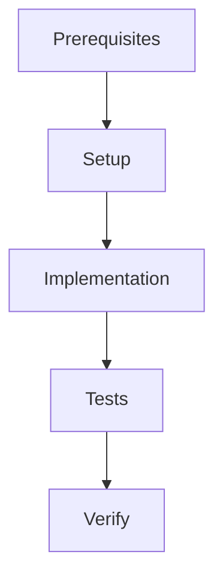

# /design - Analyze + Plan

Transform idea drafts into detailed workstream specifications with execution graphs and metadata.

## When to Use

- After `/idea` creates a draft
- When a feature spec needs to be broken down
- Before starting implementation

## Workflow

### Step 0: Enter Plan Mode

```markdown
EnterPlanMode()
```

### Step 1: Read Context (In Plan Mode)

```bash
# Core documentation
@PROJECT_MAP.md
@PROTOCOL.md
@CODE_PATTERNS.md

# Feature context (NEW)
@docs/drafts/idea-{slug}.md
@docs/intent/{slug}.json  # Machine-readable intent
@PRODUCT_VISION.md  # Product alignment (if exists)
```

### Step 2: Design Workstreams

Create enhanced workstreams with execution metadata:

```markdown
---
ws_id: 00-XXX-YY
feature: FXXX
dependencies: [00-XXX-01, 00-XXX-02]
oneshot_ready: true
estimated_loc: 450
estimated_duration: "2-3 hours"
---

## Prerequisites

**Must exist before starting:**
- `00-XXX-01` completed
- Package X installed

**Check command:**
```bash
pytest tests/unit/XXX/ -v
```

## Execution Graph



## Files

**Create:** `src/sdp/module.py` (~150 LOC)
**Modify:** `src/sdp/config.py:10-15` (add section)

## Steps

**Step 1: Create module skeleton**
```bash
mkdir -p src/sdp/module
touch src/sdp/module/__init__.py
```

**Step 2: Implement core class**
```python
# File: src/sdp/module/core.py
...
```

**Verify:** Run `pytest tests/unit/module/test_core.py`
```

### Step 3: Exit Plan Mode

```markdown
ExitPlanMode()
```

### Step 4: Generate Dependency Graph (NEW)

Create visual dependency graph using `src/sdp/design/graph.py`:

```python
from sdp.design.graph import DependencyGraph, WorkstreamNode

graph = DependencyGraph()
graph.add(WorkstreamNode("00-XXX-01", depends_on=[]))
graph.add(WorkstreamNode("00-XXX-02", depends_on=["00-XXX-01"]))
graph.add(WorkstreamNode("00-XXX-03", depends_on=["00-XXX-01"]))

# Get topological order for @oneshot
execution_order = graph.topological_sort()
```

## Enhanced WS Template

```markdown
---
ws_id: 00-XXX-YY
feature: FXXX
dependencies: [WS IDs]
oneshot_ready: true
estimated_loc: ~XXX
estimated_duration: "X-Y hours"
---

## Prerequisites

**Must exist before starting:**
- Dependency WS completed
- Required packages installed

**Check command:**
\`\`\`bash
# Verification command
\`\`\`

## Execution Graph

\`\`\`mermaid
graph TD
    A[Start] --> B[Step 1]
    B --> C[Step 2]
    C --> D[Verify]
\`\`\`

## Files

**Create:** `path/to/file.py` (~XXX LOC)
**Modify:** `path/to/existing.py:XX-YY` (description)
**Test:** `tests/unit/test_file.py` (~XXX LOC)

## Steps

**Step 1: Description**
\`\`\`bash
# Commands
\`\`\`
**Verify:** Expected output

**Step 2: Description**
\`\`\`python
# Code snippet
\`\`\`
**Verify:** Test command
```

## Output

- `docs/workstreams/backlog/WS-XXX-*.md` — Enhanced workstreams
- `docs/workstreams/INDEX.md` — Updated index
- Dependency graph for @oneshot execution

## Next Step

`/build WS-XXX-01` or `/oneshot FXXX`
