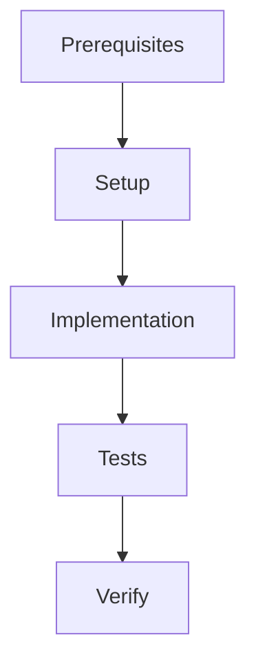

# AI-Human Communication Enhancement Implementation Plan

> **For Claude:** REQUIRED SUB-SKILL: Use superpowers:executing-plans to implement this plan task-by-task.

**Goal:** Enhance SDP's AI-Human communication with unified @feature skill, product vision layer, intent schema, and reimplemented superpowers patterns.

**Architecture:**
- **Layer 1:** @feature (unified entry) → PRODUCT_VISION.md + intent.json
- **Layer 2:** Enhanced @idea (vision interviewing) + @design (enhanced WS)
- **Layer 3:** Reimplemented skills (/tdd, /debug) with SDP identity
- **Layer 4:** Updated execution (@build, @oneshot) with new patterns

**Tech Stack:** Python 3.11+, JSON Schema, Click, existing SDP infrastructure

**Workstreams:** 9 tasks | ~3,200 LOC | 2-3 weeks

---

## Dependency Graph

```
┌─────────────────────────────────────────────────────────────┐
│                                                              │
│  Layer 1: Foundation (can parallelize)                       │
│  ┌──────────────┐  ┌──────────────┐  ┌──────────────┐       │
│  │ Task 1:      │  │ Task 2:      │  │ Task 3:      │       │
│  │ intent       │  │ tdd skill    │  │ debug skill  │       │
│  │ schema       │  │              │  │              │       │
│  └──────┬───────┘  └──────────────┘  └──────────────┘       │
│         │                                                   │
│  Layer 2: Core Skills (depends on Layer 1)                  │
│  ┌──────────────┐  ┌──────────────┐                         │
│  │ Task 4:      │  │ Task 5:      │                         │
│  │ @feature     │  │ @idea update │                         │
│  └──────┬───────┘  └──────┬───────┘                         │
│         │                   │                                 │
│  Layer 3: Planning (depends on Layer 2)                     │
│  ┌──────────────┐  ┌──────────────┐                         │
│  │ Task 6:      │  │ Task 7:      │                         │
│  │ @design      │  │ @build       │                         │
│  │  update      │  │ update       │                         │
│  └──────┬───────┘  └──────┬───────┘                         │
│         │                   │                                 │
│  Layer 4: Execution (depends on Layer 3)                    │
│  ┌──────────────┐  ┌──────────────┐                         │
│  │ Task 8:      │  │ Task 9:      │                         │
│  │ @oneshot     │  │ Integration  │                         │
│  │  update      │  │ + Docs       │                         │
│  └──────────────┘  └──────────────┘                         │
│                                                              │
└─────────────────────────────────────────────────────────────┘
```

---

## Task 1: Intent Schema + Validation

**Files:**
- Create: `docs/schema/intent.schema.json` (~150 LOC)
- Create: `src/sdp/schema/validator.py` (~200 LOC)
- Create: `src/sdp/schema/models.py` (~100 LOC)
- Create: `tests/unit/schema/test_validator.py` (~150 LOC)
- Create: `tests/unit/schema/test_models.py` (~100 LOC)

---

### Step 1: Write intent schema JSON

**File:** `docs/schema/intent.schema.json`

```json
{
  "$schema": "http://json-schema.org/draft-07/schema#",
  "title": "SDP Intent Specification",
  "description": "Machine-readable feature intent specification for AI-human communication",
  "type": "object",
  "required": ["problem", "users", "success_criteria"],
  "properties": {
    "problem": {
      "type": "string",
      "minLength": 50,
      "description": "What problem does this feature solve? Be specific."
    },
    "users": {
      "type": "array",
      "minItems": 1,
      "maxItems": 10,
      "items": {
        "type": "string",
        "enum": ["end_users", "admins", "developers", "api_consumers", "operators"]
      },
      "description": "Who are the primary users of this feature?"
    },
    "success_criteria": {
      "type": "array",
      "minItems": 1,
      "items": {
        "type": "object",
        "required": ["criterion", "measurement"],
        "properties": {
          "criterion": {"type": "string", "minLength": 10},
          "measurement": {"type": "string", "minLength": 5}
        }
      },
      "description": "How do we measure success?"
    },
    "tradeoffs": {
      "type": "object",
      "properties": {
        "security": {"enum": ["prioritize", "accept", "reject"]},
        "performance": {"enum": ["prioritize", "accept", "reject"]},
        "complexity": {"enum": ["prioritize", "accept", "reject"]},
        "time_to_market": {"enum": ["prioritize", "accept", "reject"]}
      }
    },
    "technical_approach": {
      "type": "object",
      "properties": {
        "architecture": {
          "type": "string",
          "enum": ["monolith", "microservices", "serverless", "event_driven"]
        },
        "storage": {
          "type": "string",
          "enum": ["relational_db", "nosql", "in_memory", "file_system", "none"]
        },
        "failure_mode": {
          "type": "string",
          "enum": ["graceful_degradation", "fail_closed", "queue_retry", "best_effort"]
        },
        "auth_method": {
          "type": "string",
          "enum": ["jwt", "session", "oauth2", "api_key", "none"]
        }
      }
    }
  }
}
```

---

### Step 2: Write schema validator test

**File:** `tests/unit/schema/test_validator.py`

```python
import pytest
from pathlib import Path
from sdp.schema.validator import IntentValidator, ValidationError

def test_validate_valid_intent():
    validator = IntentValidator()
    intent = {
        "problem": "Users need secure account access with social login",
        "users": ["end_users", "admins"],
        "success_criteria": [
            {"criterion": "Login success rate", "measurement": ">95%"},
            {"criterion": "Login latency", "measurement": "<500ms p95"}
        ]
    }

    # Should not raise
    validator.validate(intent)

def test_validate_missing_required_field():
    validator = IntentValidator()
    intent = {
        "users": ["end_users"]
        # Missing: problem, success_criteria
    }

    with pytest.raises(ValidationError) as exc_info:
        validator.validate(intent)

    assert "problem" in str(exc_info.value)
    assert "success_criteria" in str(exc_info.value)

def test_validate_invalid_user_enum():
    validator = IntentValidator()
    intent = {
        "problem": "Test problem" * 10,  # >50 chars
        "users": ["invalid_user_type"],
        "success_criteria": [{"criterion": "Test", "measurement": "1"}]
    }

    with pytest.raises(ValidationError) as exc_info:
        validator.validate(intent)

    assert "invalid_user_type" in str(exc_info.value)

def test_validate_min_length_problem():
    validator = IntentValidator()
    intent = {
        "problem": "Too short",  # <50 chars
        "users": ["end_users"],
        "success_criteria": [{"criterion": "Test", "measurement": "1"}]
    }

    with pytest.raises(ValidationError) as exc_info:
        validator.validate(intent)

    assert "50" in str(exc_info.value)
```

**Run:** `pytest tests/unit/schema/test_validator.py -v`
**Expected:** FAIL - No module named 'sdp.schema.validator'

---

### Step 3: Implement validator

**File:** `src/sdp/schema/validator.py`

```python
import json
from pathlib import Path
from typing import Any

class ValidationError(Exception):
    """Raised when intent validation fails."""
    def __init__(self, errors: list[str]):
        self.errors = errors
        super().__init__("\n".join(errors))

class IntentValidator:
    """Validates intent against JSON schema."""

    def __init__(self, schema_path: str | None = None):
        if schema_path is None:
            schema_path = "docs/schema/intent.schema.json"
        self._schema_path = Path(schema_path)
        self._schema = self._load_schema()

    def validate(self, intent: dict[str, Any]) -> None:
        """Validate intent against schema.

        Raises:
            ValidationError: If intent is invalid
        """
        import jsonschema

        try:
            jsonschema.validate(instance=intent, schema=self._schema)
        except jsonschema.ValidationError as e:
            raise ValidationError([self._format_error(e)])

    def validate_file(self, intent_path: str) -> dict[str, Any]:
        """Validate intent file.

        Returns:
            Parsed and validated intent dict

        Raises:
            ValidationError: If file is invalid
        """
        path = Path(intent_path)
        if not path.exists():
            raise ValidationError([f"File not found: {intent_path}"])

        intent = json.loads(path.read_text())
        self.validate(intent)
        return intent

    def _load_schema(self) -> dict:
        """Load JSON schema."""
        if not self._schema_path.exists():
            # Fallback to embedded schema
            return self._embedded_schema()

        return json.loads(self._schema_path.read_text())

    def _embedded_schema(self) -> dict:
        """Embedded schema for when file doesn't exist."""
        return {
            "$schema": "http://json-schema.org/draft-07/schema#",
            "type": "object",
            "required": ["problem", "users", "success_criteria"],
            "properties": {
                "problem": {"type": "string", "minLength": 50},
                "users": {"type": "array", "minItems": 1},
                "success_criteria": {"type": "array", "minItems": 1}
            }
        }

    def _format_error(self, error) -> str:
        """Format jsonschema error for readability."""
        path = " -> ".join(str(p) for p in error.path) if error.path else "root"
        return f"{path}: {error.message}"
```

---

### Step 4: Add jsonschema dependency

**File:** `pyproject.toml`

```toml
[project.dependencies]
jsonschema = ">=4.20.0"
```

**Run:** `poetry lock`
**Expected:** Updates poetry.lock

---

### Step 5: Create dataclass models

**File:** `src/sdp/schema/models.py`

```python
from dataclasses import dataclass, field
from typing import Literal, Required

@dataclass
class SuccessCriterion:
    criterion: str
    measurement: str

@dataclass
class TechnicalApproach:
    architecture: str | None = None
    storage: str | None = None
    failure_mode: str | None = None
    auth_method: str | None = None

@dataclass
class Tradeoffs:
    security: Literal["prioritize", "accept", "reject"] | None = None
    performance: Literal["prioritize", "accept", "reject"] | None = None
    complexity: Literal["prioritize", "accept", "reject"] | None = None
    time_to_market: Literal["prioritize", "accept", "reject"] | None = None

@dataclass
class Intent:
    """Structured intent specification."""
    problem: str
    users: list[Literal["end_users", "admins", "developers", "api_consumers", "operators"]]
    success_criteria: list[SuccessCriterion]
    tradeoffs: Tradeoffs | None = None
    technical_approach: TechnicalApproach | None = None

    @classmethod
    def from_dict(cls, data: dict) -> "Intent":
        """Create from dict, converting nested structures."""
        return cls(
            problem=data["problem"],
            users=data["users"],
            success_criteria=[
                SuccessCriterion(**sc) for sc in data["success_criteria"]
            ],
            tradeoffs=Tradeoffs(**data["tradeoffs"]) if data.get("tradeoffs") else None,
            technical_approach=TechnicalApproach(**data["technical_approach"])
                if data.get("technical_approach") else None
        )

    def to_dict(self) -> dict:
        """Convert to dict for JSON serialization."""
        return {
            "problem": self.problem,
            "users": self.users,
            "success_criteria": [
                {"criterion": sc.criterion, "measurement": sc.measurement}
                for sc in self.success_criteria
            ],
            "tradeoffs": self.tradeoffs.__dict__ if self.tradeoffs else None,
            "technical_approach": self.technical_approach.__dict__
                if self.technical_approach else None
        }
```

---

### Step 6: Write models test

**File:** `tests/unit/schema/test_models.py`

```python
from sdp.schema.models import Intent, SuccessCriterion, Tradeoffs, TechnicalApproach

def test_intent_from_dict():
    data = {
        "problem": "Users need secure login",
        "users": ["end_users"],
        "success_criteria": [
            {"criterion": "Success rate", "measurement": ">95%"}
        ],
        "tradeoffs": {
            "security": "prioritize",
            "performance": "accept"
        }
    }

    intent = Intent.from_dict(data)

    assert intent.problem == "Users need secure login"
    assert intent.users == ["end_users"]
    assert len(intent.success_criteria) == 1
    assert intent.tradeoffs.security == "prioritize"

def test_intent_to_dict():
    intent = Intent(
        problem="Test",
        users=["developers"],
        success_criteria=[SuccessCriterion("A", "B")]
    )

    data = intent.to_dict()

    assert data["problem"] == "Test"
    assert data["users"] == ["developers"]
    assert "success_criteria" in data
```

---

### Step 7: Run tests

```bash
pytest tests/unit/schema/ -v
pytest --cov=sdp.schema --cov-fail-under=80
mypy src/sdp/schema/ --strict
```

**Expected:** All passing

---

### Step 8: Commit

```bash
git add src/sdp/schema/ docs/schema/ tests/unit/schema/ pyproject.toml
git commit -m "feat(schema): Add intent schema validation

- JSON schema for machine-readable intent
- IntentValidator with ValidationError
- Intent dataclass models (SuccessCriterion, Tradeoffs, etc.)
- jsonschema dependency

Co-Authored-By: Claude Opus 4.5 <noreply@anthropic.com>"
```

---

## Task 2: /tdd Skill (Reimplemented)

**Files:**
- Create: `.claude/skills/tdd/SKILL.md` (~250 LOC)
- Create: `prompts/commands/tdd.md` (~200 LOC)
- Create: `src/sdp/tdd/runner.py` (~150 LOC)
- Create: `tests/unit/tdd/test_runner.py` (~100 LOC)

---

### Step 1: Write TDD skill

**File:** `.claude/skills/tdd/SKILL.md`

```markdown
---
name: tdd
description: Enforce Test-Driven Development discipline: Red → Green → Refactor
tools: Read, Write, Edit, Bash
---

# /tdd - Test-Driven Development

Enforce TDD discipline with Red-Green-Refactor cycle. Used internally by @build, available standalone.

## When to Use

- Writing any production code
- Fixing bugs (write test that reproduces first)
- Refactoring (test coverage first)
- Before @build execution

## The TDD Cycle

### Phase 1: RED - Write Failing Test

1. **Write test FIRST** - before any implementation code
2. **Run test** - verify it FAILS with expected error
3. **NO implementation yet** - if you wrote code, you cheated

### Phase 2: GREEN - Minimal Implementation

1. **Write minimal code** - just enough to make test pass
2. **Run test** - verify it PASSES
3. **NO refactoring yet** - that comes next

### Phase 3: REFACTOR - Improve Code

1. **Improve code** - clean up, extract, rename
2. **Run test** - verify it STILL PASSES
3. **Add more tests** if new edge cases discovered

### Phase 4: COMMIT - Save Working State

1. **Commit** - each cycle ends in a commit
2. **Message** - describes what was built

## Self-Review Checklist

After each cycle:
- [ ] Test written BEFORE implementation
- [ ] Test verified FAILING in Red phase
- [ ] Only minimal code in Green phase
- [ ] All tests passing after Refactor
- [ ] Commit created with conventional message

## Exit When

- All acceptance criteria met
- Coverage ≥ 80%
- mypy --strict passes
```

---

### Step 2: Write TDD runner

**File:** `src/sdp/tdd/runner.py`

```python
from dataclasses import dataclass
from enum import Enum
import subprocess
from pathlib import Path

class Phase(Enum):
    RED = "red"
    GREEN = "green"
    REFACTOR = "refactor"

@dataclass
class TDDResult:
    phase: Phase
    success: bool
    output: str
    next_phase: Phase | None = None

class TDDRunner:
    """Manages TDD cycle execution."""

    def __init__(self, project_dir: str | Path = "."):
        self._project = Path(project_dir)

    def red_phase(self, test_path: str) -> TDDResult:
        """Run test expecting failure."""
        result = subprocess.run(
            ["pytest", test_path, "-v"],
            cwd=self._project,
            capture_output=True,
            text=True
        )

        success = result.returncode != 0  # FAIL is expected
        return TDDResult(
            phase=Phase.RED,
            success=success,
            output=result.stdout + result.stderr,
            next_phase=Phase.GREEN if success else None
        )

    def green_phase(self, test_path: str) -> TDDResult:
        """Run tests expecting success."""
        result = subprocess.run(
            ["pytest", test_path, "-v"],
            cwd=self._project,
            capture_output=True,
            text=True
        )

        success = result.returncode == 0
        return TDDResult(
            phase=Phase.GREEN,
            success=success,
            output=result.stdout + result.stderr,
            next_phase=Phase.REFACTOR if success else Phase.GREEN
        )

    def refactor_phase(self, test_path: str) -> TDDResult:
        """Run tests after refactoring."""
        result = subprocess.run(
            ["pytest", test_path, "-v"],
            cwd=self._project,
            capture_output=True,
            text=True
        )

        success = result.returncode == 0
        return TDDResult(
            phase=Phase.REFACTOR,
            success=success,
            output=result.stdout + result.stderr,
            next_phase=None  # Cycle complete
        )
```

---

### Step 3: Write tests

**File:** `tests/unit/tdd/test_runner.py`

```python
from sdp.tdd.runner import TDDRunner, Phase

def test_red_phase_expects_failure(tmp_path):
    # Create a test that fails
    test_file = tmp_path / "test_fail.py"
    test_file.write_text("def test_not_impl(): assert False")

    runner = TDDRunner(tmp_path)
    result = runner.red_phase(str(test_file))

    assert result.phase == Phase.RED
    assert result.success is True  # Failure is expected!
    assert "FAILED" in result.output

def test_green_phase_expects_success(tmp_path):
    test_file = tmp_path / "test_pass.py"
    test_file.write_text("def test_pass(): assert True")

    runner = TDDRunner(tmp_path)
    result = runner.green_phase(str(test_file))

    assert result.phase == Phase.GREEN
    assert result.success is True
    assert "PASSED" in result.output
```

---

### Step 4: Commit

```bash
git add .claude/skills/tdd/ prompts/commands/tdd.md src/sdp/tdd/ tests/unit/tdd/
git commit -m "feat(tdd): Add TDD skill with cycle enforcement

- /tdd skill: Red → Green → Refactor → Commit
- TDDRunner for automated cycle execution
- Self-review checklist for discipline
- Used by @build internally

Co-Authored-By: Claude Opus 4.5 <noreply@anthropic.com>"
```

---

## Task 3: /debug Skill (Reimplemented)

**Files:**
- Create: `.claude/skills/debug/SKILL.md` (~200 LOC)
- Create: `prompts/commands/debug.md` (~150 LOC)

---

### Step 1: Write debug skill

**File:** `.claude/skills/debug/SKILL.md`

```markdown
---
name: debug
description: Systematic debugging using scientific method for evidence-based root cause analysis
tools: Read, Write, Edit, Bash, Grep, Glob
---

# /debug - Systematic Debugging

Evidence-based debugging using scientific method. Not "try stuff and see" — systematic investigation.

## When to Use

- Tests failing unexpectedly
- Production incidents
- Bug reports with unclear cause
- Performance degradation
- Integration failures

## The 4-Phase Method

### Phase 1: OBSERVE - Gather Facts

**Goal:** Collect evidence WITHOUT forming hypotheses

**Actions:**
- Read error messages/logs completely
- Check git diff for recent changes
- Verify environment (Python version, dependencies)
- Check configuration files
- Reproduce the bug consistently

**Output:** Observation log with timestamps, error messages, environment state

### Phase 2: HYPOTHESIZE - Form Theories

**Goal:** Create testable theories about root cause

**Process:**
1. List ALL possible causes (brainstorm)
2. Rank by likelihood (use evidence)
3. Select TOP theory to test first
4. Define falsification test

**Output:** Hypothesis list with ranked theories

### Phase 3: EXPERIMENT - Test Theories

**Goal:** Run targeted tests to confirm/deny hypotheses

**Actions:**
- Design minimal experiment
- Run ONLY the experiment
- Record result objectively
- Move to next hypothesis if denied

**Output:** Experiment results with pass/fail

### Phase 4: CONFIRM - Verify Root Cause

**Goal:** Confirm root cause and verify fix

**Actions:**
- Reproduce bug with root cause isolated
- Implement minimal fix
- Verify fix resolves issue
- Add regression test

**Output:** Root cause report + fix

## Common Pitfalls

- **Skipping observation** → jumping to conclusions
- **Testing multiple things at once** → can't isolate cause
- **Confirmation bias** → only looking for evidence that proves theory
- **Stopping at first fix** → not understanding WHY it worked

## Exit When

- Root cause identified
- Fix implemented and verified
- Regression test added
```

---

### Step 2: Commit

```bash
git add .claude/skills/debug/ prompts/commands/debug.md
git commit -m "feat(debug): Add systematic debugging skill

- 4-phase method: Observe → Hypothesize → Experiment → Confirm
- Evidence-based root cause analysis
- Used for test failures, production incidents, bugs

Co-Authored-By: Claude Opus 4.5 <noreply@anthropic.com>"
```

---

## Task 4: /feature Skill (New Unified Entry)

**Files:**
- Create: `.claude/skills/feature/SKILL.md` (~400 LOC)
- Create: `prompts/commands/feature.md` (~300 LOC)
- Create: `src/sdp/feature/vision.py` (~150 LOC)
- Create: `tests/unit/feature/test_vision.py` (~100 LOC)

---

### Key Implementation

**File:** `.claude/skills/feature/SKILL.md`

```markdown
---
name: feature
description: Unified entry point for feature development with progressive disclosure
tools: Read, Write, Edit, Bash, AskUserQuestion, Skill
---

# /feature - Unified Feature Development

Progressive disclosure workflow: vision → requirements → planning → execution.

## When to Use

- Starting new feature (recommended for all)
- Exploring feature idea
- Creating MVP from scratch
- Power users can skip to @idea or @design directly

## Workflow

### Phase 1: Vision Interview (3-5 questions)

AskUserQuestion about:
- **Mission**: What problem do we solve?
- **Users**: Who are we building for?
- **Success Metrics**: How do we measure success?

### Phase 2: Generate PRODUCT_VISION.md

Create or update `PRODUCT_VISION.md` at project root.

### Phase 3: Technical Interview (5-8 questions)

AskUserQuestion about:
- Technical approach (architecture, storage, failure mode)
- Tradeoffs (security vs performance, complexity vs speed)
- Integration points

### Phase 4: Generate intent.json

Validate against `docs/schema/intent.schema.json`, save to `docs/intent/{slug}.json`

### Phase 5: Transition to @design

Call `/design` with full context (vision + intent).

## Power User Flags

- `--vision-only` — Only create vision, skip planning
- `--no-interview` — Skip questions, use defaults
- `--update-vision` — Update existing PRODUCT_VISION.md
- `--spec PATH` — Start from existing spec

## Output

- `PRODUCT_VISION.md` — Project manifesto
- `docs/drafts/idea-{slug}.md` — Full spec
- `docs/intent/{slug}.json` — Machine-readable intent
```

---

**File:** `src/sdp/feature/vision.py`

```python
from dataclasses import dataclass
from pathlib import Path
from datetime import datetime

@dataclass
class ProductVision:
    """Product vision manifesto."""
    mission: str
    users: list[str]
    success_metrics: list[str]
    strategic_tradeoffs: dict[str, str]
    non_goals: list[str]
    updated: datetime

    def to_markdown(self) -> str:
        """Convert to markdown format."""
        return f"""# PRODUCT_VISION.md

> **Last Updated:** {self.updated.strftime("%Y-%m-%d")}

## Mission

{self.mission}

## Users

{chr(10).join(f"{i+1}. **{u}**" for i, u in enumerate(self.users))}

## Success Metrics

{chr(10).join(f"- [ ] {m}" for m in self.success_metrics)}

## Strategic Tradeoffs

{chr(10).join(f"- **{k}**: {v}" for k, v in self.strategic_tradeoffs.items())}

## Non-Goals

{chr(10).join(f"- {ng}" for ng in self.non_goals)}
"""

class VisionManager:
    """Manages PRODUCT_VISION.md file."""

    def __init__(self, project_root: str | Path = "."):
        self._root = Path(project_root)
        self._vision_file = self._root / "PRODUCT_VISION.md"

    def save(self, vision: ProductVision) -> None:
        """Save vision to file."""
        self._vision_file.write_text(vision.to_markdown())

    def load(self) -> ProductVision | None:
        """Load vision from file."""
        if not self._vision_file.exists():
            return None
        # Parse markdown... (implementation)
        return None
```

---

### Commit

```bash
git add .claude/skills/feature/ prompts/commands/feature.md src/sdp/feature/ tests/unit/feature/
git commit -m "feat(feature): Add unified feature entry point

- @feature: Vision interview → PRODUCT_VISION.md → intent.json
- Progressive disclosure with power user flags
- VisionManager for manifesto CRUD
- Transitions to @design with full context

Co-Authored-By: Claude Opus 4.5 <noreply@anthropic.com>"
```

---

## Task 5: @idea Skill Update

**Files:**
- Modify: `.claude/skills/idea/SKILL.md` (+150 LOC)
- Modify: `prompts/commands/idea.md` (+100 LOC)

**Changes:**
- Add product vision questions to interview
- Generate intent.json after draft
- Validate against schema
- Reference PRODUCT_VISION.md

**Key addition to interview:**

```markdown
AskUserQuestion({
  "questions": [{
    "question": "What is the core mission of this product?",
    "header": "Mission",
    "options": [
      {"label": "Solve specific pain point", "description": "Addresses clear user frustration"},
      {"label": "Enable new capability", "description": " unlocks something previously impossible"},
      {"label": "Improve efficiency", "description": "Makes existing process faster/cheaper"}
    ]
  }]
})
```

---

### Commit

```bash
git add .claude/skills/idea/ prompts/commands/idea.md
git commit -m "feat(idea): Enhance with vision + schema validation

- Product vision questions (mission, users, metrics)
- intent.json generation with schema validation
- PRODUCT_VISION.md integration
- Links to @design for next step

Co-Authored-By: Claude Opus 4.5 <noreply@anthropic.com>"
```

---

## Task 6: @design Skill Update

**Files:**
- Modify: `.claude/skills/design/SKILL.md` (+200 LOC)
- Modify: `prompts/commands/design.md` (+150 LOC)
- Create: `src/sdp/design/graph.py` (~150 LOC)

**Changes:**
- Read intent.json for structured requirements
- Read PRODUCT_VISION.md for alignment
- Generate enhanced workstreams (Prerequisites, Files, Graph, Steps)
- Generate execution metadata for oneshot
- Create dependency graph

**Enhanced WS template:**

```markdown
---
ws_id: 00-XXX-YY
feature: FXXX
dependencies: [00-XXX-01, 00-XXX-02]
oneshot_ready: true
estimated_loc: 450
estimated_duration: "2-3 hours"
---

## Prerequisites

**Must exist before starting:**
- `00-XXX-01` completed
- Package X installed

**Check command:**
```bash
pytest tests/unit/XXX/ -v
```

## Execution Graph



## Files

**Create:** `src/sdp/module.py` (~150 LOC)
**Modify:** `src/sdp/config.py:10-15` (add section)

## Steps

**Step 1: Create module skeleton**
```bash
mkdir -p src/sdp/module
touch src/sdp/module/__init__.py
```

**Step 2: Implement core class**
```python
# File: src/sdp/module/core.py
...
```
```

---

### Commit

```bash
git add .claude/skills/design/ prompts/commands/design.md src/sdp/design/
git commit -m "feat(design): Enhanced workstreams with execution metadata

- Prerequisites section with check commands
- Execution graph (Mermaid)
- File inventory (create/modify/test)
- Bite-sized steps with verify
- Oneshot metadata for autonomous execution

Co-Authored-By: Claude Opus 4.5 <noreply@anthropic.com>"
```

---

## Task 7: @build Skill Update

**Files:**
- Modify: `.claude/skills/build/SKILL.md` (+150 LOC)
- Modify: `prompts/commands/build.md` (+100 LOC)

**Changes:**
- Call /tdd internally for cycle enforcement
- Follow bite-sized steps from enhanced WS
- Progress reporting (Step 1/5)
- Verify prerequisites before starting
- Self-review after each step

**Key pattern:**

```markdown
For each step in workstream:
1. Call /tdd to enforce Red-Green-Refactor
2. Verify output matches expectation
3. Mark progress (Step N/M complete)
4. If step fails: stop, report, wait for guidance
```

---

### Commit

```bash
git add .claude/skills/build/ prompts/commands/build.md
git commit -m "feat(build): Integrate TDD + enhanced WS execution

- Calls /tdd for cycle enforcement
- Follows bite-sized steps from enhanced WS
- Progress reporting (Step N/M)
- Prerequisites verification
- Self-review after each step

Co-Authored-By: Claude Opus 4.5 <noreply@anthropic.com>"
```

---

## Task 8: @oneshot Skill Update

**Files:**
- Modify: `.claude/skills/oneshot/SKILL.md` (+150 LOC)
- Modify: `prompts/commands/oneshot.md` (+100 LOC)

**Changes:**
- Read execution graph from plan
- Topological sort for execution order
- Checkpoints after each WS
- Resume from checkpoint capability
- Two-stage review after all WS

**Checkpoint format:**

```json
{
  "feature": "F012",
  "completed_ws": ["00-012-01", "00-012-02"],
  "current_ws": "00-012-03",
  "status": "in_progress",
  "timestamp": "2026-01-26T12:00:00Z"
}
```

---

### Commit

```bash
git add .claude/skills/oneshot/ prompts/commands/oneshot.md
git commit -m "feat(oneshot): Enhanced multi-WS execution

- Reads execution graph from plan
- Topological sort for correct order
- Checkpoints after each WS (resume capability)
- Two-stage review after completion
- Progress tracking in .oneshot/

Co-Authored-By: Claude Opus 4.5 <noreply@anthropic.com>"
```

---

## Task 9: Integration + Documentation

**Files:**
- Create: `PRODUCT_VISION.md` (~100 LOC)
- Update: `CLAUDE.md` (+200 LOC)
- Update: `README.md` (+100 LOC)
- Update: `docs/PROJECT_MAP.md` (+50 LOC)

---

### Step 1: Create PRODUCT_VISION.md

**File:** `PRODUCT_VISION.md`

```markdown
# PRODUCT_VISION.md

> **Last Updated:** 2026-01-26
> **Version:** 1.0

## Mission

SDP is a spec-driven development framework that enables AI agents and humans to collaborate on building reliable, maintainable software.

## Users

1. **Solo developers** building AI-assisted projects
2. **Small teams** (2-5 engineers) with AI workflows
3. **DevOps engineers** integrating SDP into CI/CD

## Success Metrics

- [ ] Time from idea to running code: <1 hour
- [ ] New user onboarding: <30 min to first WS
- [ ] Test feedback latency: <2 seconds (watch mode)
- [ ] Feature completion rate: >85%

## Strategic Tradeoffs

| Aspect | Decision | Rationale |
|--------|----------|-----------|
| DX vs Control | Prioritize DX | Friction kills adoption |
| Speed vs Quality | Both | TDD + quality gates |
| Simple vs Expressive | Progressive | Simple entry, power when needed |

## Non-Goals

- Real-time collaboration (multiplayer)
- Enterprise SSO (out of scope)
- Language-agnostic (Python-first, extensible)
```

---

### Step 2: Update CLAUDE.md

**Add new commands:**

```markdown
## Available Skills

| Skill | Purpose | When to Use |
|-------|---------|-------------|
| @feature | Unified feature development | Starting new feature (recommended) |
| @idea | Deep requirements gathering | Exploring complex requirements |
| @design | Workstream decomposition | After @idea or @feature |
| @build | Execute single workstream | Implementing workstream |
| @oneshot | Multi-WS execution | Batch execution with checkpoints |
| @tdd | TDD discipline enforcement | Writing code |
| @debug | Systematic debugging | Investigating failures |
```

---

### Step 3: Commit

```bash
git add PRODUCT_VISION.md CLAUDE.md README.md docs/PROJECT_MAP.md
git commit -m "docs(ai-comm): Complete AI-Human communication enhancement

- New @feature unified entry point
- Enhanced @idea with vision + schema
- Enhanced @design with execution graphs
- Reimplemented /tdd and /debug skills
- Updated @build and @oneshot
- PRODUCT_VISION.md for project alignment

Co-Authored-By: Claude Opus 4.5 <noreply@anthropic.com>"
```

---

## Summary

**Total Tasks:** 9
**Total LOC:** ~3,200
**Estimated Duration:** 2-3 weeks

**New Commands:**
- `/feature "Description"` — Unified entry point
- `/tdd` — TDD cycle enforcement
- `/debug` — Systematic debugging

**Enhanced Commands:**
- `/idea` — + vision questions, + intent.json
- `/design` — + enhanced WS, + execution graphs
- `/build` — + TDD integration, + progress reporting
- `/oneshot` — + checkpoint resume

**Artifacts:**
- `PRODUCT_VISION.md` — Project manifesto
- `docs/schema/intent.schema.json` — Intent validation
- `docs/intent/{slug}.json` — Machine-readable intent
- Enhanced workstreams — Prerequisites, Files, Graph, Steps

---

**End of Implementation Plan**

**For Claude:** Use superpowers:executing-plans to implement this plan task-by-task.
