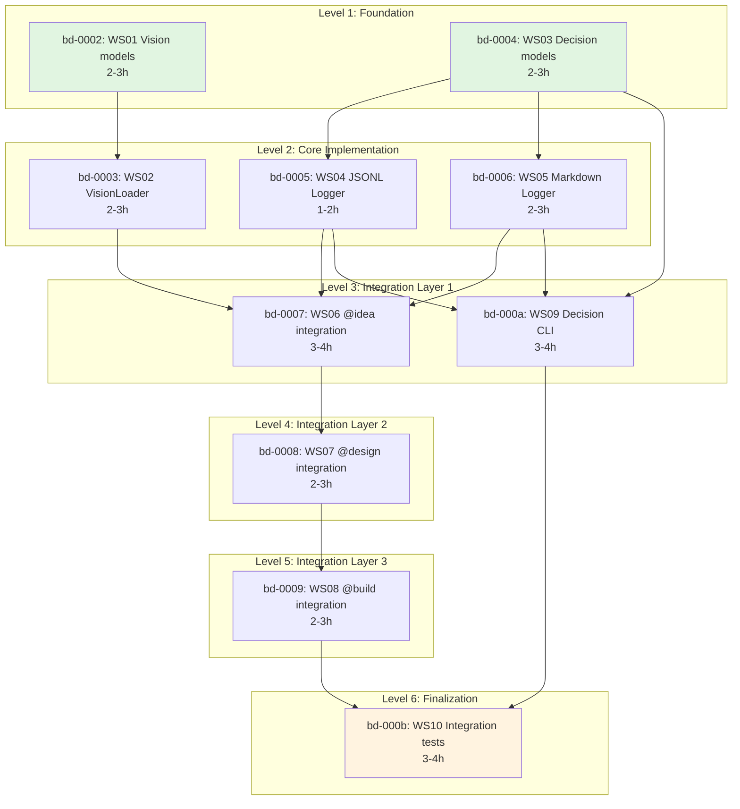

# Workstreams for F015: AI-Human Communication Enhancement

> **Parent Task:** bd-0001
> **Created:** 2026-01-28
> **Status:** Design Complete
> **Total Workstreams:** 10
> **Estimated Duration:** 25-35 hours

---

## Execution Graph



---

## Workstream Details

### Level 1: Foundation (Parallel)

#### 1. bd-0002: WS01 - Vision models and validation
**Status:** READY TO START
**Estimated:** 250 LOC, 2-3 hours
**Dependencies:** None

Create domain models for PRODUCT_VISION.md:
- `Vision` dataclass (mission, users, success_metrics, tradeoffs, non_goals)
- `VisionValidationError` exception
- `VisionValidator` class with schema validation
- Unit tests for validation logic

**Location:** `src/sdp/vision/models.py`, `src/sdp/vision/validator.py`

**Acceptance Criteria:**
- [ ] Vision model validates required fields
- [ ] VisionValidationError raised on invalid YAML frontmatter
- [ ] 100% test coverage
- [ ] <200 LOC per file

---

#### 3. bd-0004: WS03 - Decision models and logger core
**Status:** READY TO START
**Estimated:** 250 LOC, 2-3 hours
**Dependencies:** None

Create decision logging models and core logger:
- `Decision` dataclass (timestamp, type, feature_id, question, answer, context)
- `DecisionType` enum (ASK_USER_QUESTION, EXPLICIT_COMMIT)
- `DecisionLogger` abstract interface
- Decision entry serialization

**Location:** `src/sdp/decisions/models.py`, `src/sdp/decisions/logger.py`

**Acceptance Criteria:**
- [ ] Decision model with all required fields
- [ ] DecisionType enum values
- [ ] DecisionLogger interface with `log()` method
- [ ] JSON serialization for decisions
- [ ] 100% test coverage
- [ ] <200 LOC per file

---

### Level 2: Core Implementation

#### 2. bd-0003: WS02 - VisionLoader implementation
**Status:** BLOCKED by bd-0002
**Estimated:** 200 LOC, 2-3 hours
**Dependencies:** [bd-0002]

Implement `VisionLoader` to load and parse PRODUCT_VISION.md:
- `VisionLoader` class with `load()` method
- YAML frontmatter parser
- File not found handling
- Schema validation integration
- Integration with VisionValidator

**Location:** `src/sdp/vision/loader.py`

**Acceptance Criteria:**
- [ ] Loads PRODUCT_VISION.md from project root
- [ ] Parses YAML frontmatter
- [ ] Validates against schema
- [ ] Returns Vision domain model
- [ ] 100% test coverage
- [ ] <200 LOC

---

#### 4. bd-0005: WS04 - JSONL decision logger
**Status:** BLOCKED by bd-0004
**Estimated:** 180 LOC, 1-2 hours
**Dependencies:** [bd-0004]

Implement JSONL append-only logger:
- `JsonlDecisionLogger` class
- Append-only file writes (no overwrites)
- File rotation support (optional)
- Async write support (mitigation for overhead)
- `.sdp/decisions.jsonl` path

**Location:** `src/sdp/decisions/jsonl_logger.py`

**Acceptance Criteria:**
- [ ] Appends decisions to JSONL file
- [ ] Creates `.sdp` directory if missing
- [ ] Thread-safe writes (optional)
- [ ] 100% test coverage
- [ ] <200 LOC

---

#### 5. bd-0006: WS05 - Markdown decision logger
**Status:** BLOCKED by bd-0004
**Estimated:** 200 LOC, 2-3 hours
**Dependencies:** [bd-0004]

Implement Markdown decision logger:
- `MarkdownDecisionLogger` class
- Human-readable format for decisions
- `docs/DECISIONS.md` output
- Decision linking to Beads tasks
- Section organization by date/feature

**Location:** `src/sdp/decisions/md_logger.py`

**Acceptance Criteria:**
- [ ] Writes to `docs/DECISIONS.md`
- [ ] Human-readable format
- [ ] Includes timestamp, question, answer
- [ ] Links to Beads task IDs
- [ ] 100% test coverage
- [ ] <200 LOC

---

### Level 3: Integration Layer 1

#### 6. bd-0007: WS06 - @idea skill integration
**Status:** BLOCKED by bd-0002, bd-0003, bd-0005, bd-0006
**Estimated:** 300 LOC, 3-4 hours
**Dependencies:** [bd-0002, bd-0003, bd-0005, bd-0006]

Integrate `VisionLoader` into @idea skill:
- Load PRODUCT_VISION.md at skill startup
- Pass vision context to interview
- Add vision awareness to questions
- Log interview answers as decisions
- Alignment checking (optional warning)

**Location:** `.claude/skills/idea/SKILL.md` update

**Acceptance Criteria:**
- [ ] @idea auto-loads PRODUCT_VISION.md
- [ ] Interview answers logged to decisions
- [ ] Misalignment warnings (optional)
- [ ] Backward compatible (works without vision)
- [ ] Integration tests
- [ ] <200 LOC changes

---

#### 9. bd-000a: WS09 - Decision viewer CLI
**Status:** BLOCKED by bd-0004, bd-0005, bd-0006
**Estimated:** 300 LOC, 3-4 hours
**Dependencies:** [bd-0004, bd-0005, bd-0006]

Implement `sdp decisions` CLI command:
- List recent decisions
- Filter by feature, type, date
- Show decision details
- Mermaid graph of decision chain
- Integration with Beads metadata

**Location:** `src/sdp/cli/decisions.py`

**Acceptance Criteria:**
- [ ] `sdp decisions` lists recent
- [ ] `--feature`, `--type`, `--since` filters
- [ ] `sdp decisions <id>` shows details
- [ ] Mermaid output for chains
- [ ] Man page / help text
- [ ] 100% test coverage
- [ ] <300 LOC

---

### Level 4: Integration Layer 2

#### 7. bd-0008: WS07 - @design skill integration
**Status:** BLOCKED by bd-0002, bd-0003, bd-0005, bd-0006, bd-0007
**Estimated:** 250 LOC, 2-3 hours
**Dependencies:** [bd-0002, bd-0003, bd-0005, bd-0006, bd-0007]

Integrate `VisionLoader` into @design skill:
- Load vision at startup
- Pass vision to workstream planning
- Log architectural decisions
- Vision-aware decomposition suggestions

**Location:** `.claude/skills/design/SKILL.md` update

**Acceptance Criteria:**
- [ ] @design loads PRODUCT_VISION.md
- [ ] Decisions logged during planning
- [ ] Vision context in workstream metadata
- [ ] Backward compatible
- [ ] Integration tests
- [ ] <200 LOC changes

---

### Level 5: Integration Layer 3

#### 8. bd-0009: WS08 - @build skill integration
**Status:** BLOCKED by bd-0004, bd-0005, bd-0006, bd-0007
**Estimated:** 200 LOC, 2-3 hours
**Dependencies:** [bd-0004, bd-0005, bd-0006, bd-0007]

Integrate `DecisionLogger` into @build skill:
- Log workstream execution decisions
- Log error resolutions
- Track refactoring decisions
- Link to parent Beads task

**Location:** `.claude/skills/build/SKILL.md` update

**Acceptance Criteria:**
- [ ] Execution decisions logged
- [ ] Error resolutions captured
- [ ] Links to Beads tasks
- [ ] Backward compatible
- [ ] Integration tests
- [ ] <200 LOC changes

---

### Level 6: Finalization

#### 10. bd-000b: WS10 - Integration tests and documentation
**Status:** BLOCKED by ALL
**Estimated:** 400 LOC (tests), 3-4 hours
**Dependencies:** [bd-0002, bd-0003, bd-0004, bd-0005, bd-0006, bd-0007, bd-0008, bd-0009, bd-000a]

End-to-end testing and documentation:
- Integration tests for full workflow
- @idea → @design → @build with vision
- Decision log verification
- Update CLAUDE.md with new features
- Update PROTOCOL.md if needed
- Create examples

**Location:** `tests/integration/test_f015_*`, `docs/`

**Acceptance Criteria:**
- [ ] 3+ integration test scenarios
- [ ] All tests passing
- [ ] Documentation updated
- [ ] Examples work end-to-end
- [ ] Coverage ≥80%

---

## Parallel Execution Opportunities

**Level 1** can run in parallel:
- bd-0002 (Vision models) ← can start NOW
- bd-0004 (Decision models) ← can start NOW

**Level 2** can run in parallel:
- bd-0003 (VisionLoader) ← after bd-0002
- bd-0005 (JSONL logger) ← after bd-0004
- bd-0006 (MD logger) ← after bd-0004

**Level 3** partial parallel:
- bd-0007 (@idea) ← after bd-0002, bd-0003, bd-0005, bd-0006
- bd-000a (CLI) ← after bd-0004, bd-0005, bd-0006 (can start with @idea)

---

## Ready to Start

```bash
# Check ready tasks
bd ready

# Start first workstream
@build bd-0002

# Or autonomous execution (follows dependency graph)
@oneshot bd-0001
```

---

## Success Metrics

1. **Alignment Score:** % features aligned-checked with PRODUCT_VISION.md
2. **Decision Coverage:** % architectural decisions with audit trail
3. **AI Context Hits:** # times AI used vision in reasoning

---

**Design Status:** ✅ COMPLETE
**Next Step:** Execute bd-0002 or bd-0004 (both ready)
**Total LOC:** 2530
**Total Duration:** 25-35 hours
