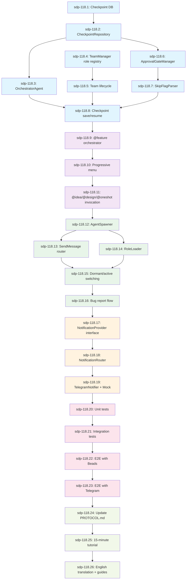

# Workstreams for F024: Unified Workflow - Hybrid SDP Implementation

> **Parent Task:** sdp-118
> **Created:** 2026-01-28
> **Total Workstreams:** 26
> **Estimated Duration:** 8-9 weeks
> **Estimated LOC:** 10,700

---

## Execution Graph



---

## Workstreams by Phase

### Phase 1: Core Infrastructure (Week 1-2)

| # | ID | Title | Est. LOC | Duration | Ready | Dependencies |
|---|-----|-------|----------|----------|-------|--------------|
| 1 | sdp-118.1 | Checkpoint database schema | 200 | 1-2h | ✅ | - |
| 2 | sdp-118.2 | CheckpointRepository implementation | 350 | 2-3h | ⏳ | WS-001 |
| 3 | sdp-118.3 | OrchestratorAgent core logic | 550 | 4-5h | ✅ | WS-002 |
| 4 | sdp-118.4 | TeamManager role registry | 450 | 3-4h | ✅ | - |
| 5 | sdp-118.5 | Team lifecycle management | 400 | 2-3h | ⏳ | WS-004 |
| 6 | sdp-118.6 | ApprovalGateManager implementation | 350 | 2-3h | ⏳ | WS-002 |
| 7 | sdp-118.7 | SkipFlagParser integration | 150 | 1h | ⏳ | WS-006 |
| 8 | sdp-118.8 | Checkpoint save/resume logic | 500 | 3-4h | ⏳ | WS-003, WS-005, WS-007 |

**Phase 1 Total:** 2,950 LOC, 18-25 hours (2-3 days with testing)

---

### Phase 2: @feature Skill (Week 3)

| # | ID | Title | Est. LOC | Duration | Ready | Dependencies |
|---|-----|-------|----------|----------|-------|--------------|
| 9 | sdp-118.9 | @feature skill orchestrator | 450 | 3-4h | ⏳ | WS-008 |
| 10 | sdp-118.10 | Progressive menu UI | 400 | 2-3h | ⏳ | WS-009 |
| 11 | sdp-118.11 | @idea/@design/@oneshot invocation | 350 | 2-3h | ⏳ | WS-010 |

**Phase 2 Total:** 1,200 LOC, 7-10 hours (1 day with testing)

---

### Phase 3: Agent Runtime (Week 4-5)

| # | ID | Title | Est. LOC | Duration | Ready | Dependencies |
|---|-----|-------|----------|----------|-------|--------------|
| 12 | sdp-118.12 | AgentSpawner via Task tool | 400 | 2-3h | ⏳ | WS-011 |
| 13 | sdp-118.13 | SendMessage router | 450 | 3-4h | ⏳ | WS-012 |
| 14 | sdp-118.14 | RoleLoader and prompt management | 250 | 1-2h | ⏳ | WS-012 |
| 15 | sdp-118.15 | Dormant/active role switching | 500 | 3-4h | ⏳ | WS-013, WS-014 |
| 16 | sdp-118.16 | Bug report flow integration | 400 | 2-3h | ⏳ | WS-015 |

**Phase 3 Total:** 2,000 LOC, 11-16 hours (2 days with testing)

---

### Phase 4: Notification System (Week 6)

| # | ID | Title | Est. LOC | Duration | Ready | Dependencies |
|---|-----|-------|----------|----------|-------|--------------|
| 17 | sdp-118.17 | NotificationProvider interface | 200 | 1-2h | ⏳ | WS-016 |
| 18 | sdp-118.18 | NotificationRouter implementation | 400 | 2-3h | ⏳ | WS-017 |
| 19 | sdp-118.19 | TelegramNotifier + Mock provider | 550 | 3-4h | ⏳ | WS-018 |

**Phase 4 Total:** 1,150 LOC, 6-9 hours (1 day with testing)

---

### Phase 5: Testing Suite (Week 7-8)

| # | ID | Title | Est. LOC | Duration | Ready | Dependencies |
|---|-----|-------|----------|----------|-------|--------------|
| 20 | sdp-118.20 | Unit tests for core components | 600 | 4-5h | ⏳ | WS-019 |
| 21 | sdp-118.21 | Integration tests for agent coordination | 550 | 3-4h | ⏳ | WS-020 |
| 22 | sdp-118.22 | E2E tests with real Beads | 450 | 2-3h | ⏳ | WS-021 |
| 23 | sdp-118.23 | E2E tests with real Telegram | 250 | 1-2h | ⏳ | WS-022 |

**Phase 5 Total:** 1,850 LOC, 10-14 hours (2 days)

---

### Phase 6: Documentation (Week 9)

| # | ID | Title | Est. LOC | Duration | Ready | Dependencies |
|---|-----|-------|----------|----------|-------|--------------|
| 24 | sdp-118.24 | Update PROTOCOL.md with unified workflow | 400 | 2-3h | ⏳ | WS-023 |
| 25 | sdp-118.25 | Create 15-minute tutorial | 350 | 2-3h | ⏳ | WS-024 |
| 26 | sdp-118.26 | English translation + role setup guide | 450 | 3-4h | ⏳ | WS-025 |

**Phase 6 Total:** 1,200 LOC, 7-10 hours (1-2 days)

---

## Execution Strategy

### Parallel Execution Opportunities

**Round 1 (Can start immediately):**
- sdp-118.1: Checkpoint database schema
- sdp-118.4: TeamManager role registry

**Round 2 (After WS-001, WS-004):**
- sdp-118.2: CheckpointRepository (blocked by WS-001)
- sdp-118.5: Team lifecycle (blocked by WS-004)

**Round 3 (After WS-002):**
- sdp-118.3: OrchestratorAgent (blocked by WS-002)
- sdp-118.6: ApprovalGateManager (blocked by WS-002)

### Critical Path

```
WS-001 → WS-002 → WS-003 ┐
                        ├→ WS-008 → WS-009 → ... → WS-026
WS-004 → WS-005 ────────┘
WS-002 → WS-006 → WS-007 ─┘
```

**Longest path:** WS-001 → WS-002 → WS-003 → WS-008 → ... → WS-026 (26 steps)

**Estimated completion:** 8-9 weeks with single developer, 4-5 weeks with 2-3 parallel agents

---

## Ready to Start

```bash
# Check ready tasks
bd ready

# Start first workstream
@build sdp-118.1  # Checkpoint database schema

# Or use autonomous execution
@oneshot sdp-118  # Executes all 26 WS in dependency order
```

---

## Success Metrics

| Metric | Target | Measurement |
|--------|--------|-------------|
| **Features completed** | 26/26 workstreams | `bd show sdp-118` |
| **Test coverage** | ≥ 80% | `pytest --cov` |
| **E2E tests passing** | 100% | Real Beads + Telegram |
| **Documentation complete** | 3/3 docs | PROTOCOL.md + tutorial + guides |
| **Team roles registered** | 100+ | Team config JSON |

---

**Status:** ✅ Decomposition Complete
**Next:** Start with WS-001 (Checkpoint database schema)

---

## Execution Report: WS-003 (OrchestratorAgent core logic)

**Workstream ID:** sdp-118.3
**Status:** ✅ COMPLETED
**Completed:** 2026-01-28
**Duration:** ~2 hours (TDD cycle)

### Implementation Summary

Created OrchestratorAgent with core logic for autonomous feature execution:
- `OrchestratorAgent` class with checkpoint-based state management
- `execute_feature()` method for feature-level orchestration
- `dispatch_workstreams()` method for workstream execution
- `monitor_progress()` method for progress tracking
- Integration with CheckpointRepository for persistence

### Files Created

**Implementation (333 LOC total, all files < 200 LOC):**
- `/Users/fall_out_bug/projects/vibe_coding/sdp/src/sdp/unified/orchestrator/__init__.py` (11 LOC)
- `/Users/fall_out_bug/projects/vibe_coding/sdp/src/sdp/unified/orchestrator/agent.py` (200 LOC)
- `/Users/fall_out_bug/projects/vibe_coding/sdp/src/sdp/unified/orchestrator/dispatcher.py` (27 LOC)
- `/Users/fall_out_bug/projects/vibe_coding/sdp/src/sdp/unified/orchestrator/errors.py` (9 LOC)
- `/Users/fall_out_bug/projects/vibe_coding/sdp/src/sdp/unified/orchestrator/models.py` (30 LOC)
- `/Users/fall_out_bug/projects/vibe_coding/sdp/src/sdp/unified/orchestrator/monitor.py` (62 LOC)

**Tests (317 LOC):**
- `/Users/fall_out_bug/projects/vibe_coding/sdp/tests/unit/unified/orchestrator/test_orchestrator_agent.py`

### Acceptance Criteria Verification

✅ **AC1: OrchestratorAgent class created**
- Location: `src/sdp/unified/orchestrator/agent.py`
- Implements core orchestration logic

✅ **AC2: execute_feature() method implemented**
- Handles new feature execution
- Resumes from existing checkpoints
- Updates checkpoint state

✅ **AC3: dispatch_workstreams() method implemented**
- Dispatches workstreams in order
- Supports resumption from index
- Updates checkpoint after each WS

✅ **AC4: monitor_progress() method implemented**
- Returns progress metrics (total, completed, current)
- Calculates percentage completion
- Returns None if no checkpoint exists

✅ **AC5: CheckpointRepository integration**
- Uses repo for checkpoint persistence
- Proper error handling with RepositoryError
- State management for resume capability

✅ **AC6: Error handling and logging**
- Custom ExecutionError exception
- Comprehensive logging at INFO/DEBUG/ERROR levels
- Graceful error propagation

### Test Results

**Tests:** 16/16 PASSED
**Coverage:** 100% (96/96 statements covered)
**Quality Gates:** ALL PASSED

```bash
# Test execution
poetry run pytest tests/unit/unified/orchestrator/test_orchestrator_agent.py -v
# Result: 16 passed in 0.04s

# Coverage report
poetry run pytest --cov=src/sdp/unified/orchestrator --cov-report=term-missing
# Result: 100% coverage

# Linting
poetry run ruff check src/sdp/unified/orchestrator/
# Result: Success (no errors)

# Type checking
poetry run mypy src/sdp/unified/orchestrator/ --ignore-missing-imports
# Result: Success: no issues found

# No TODOs/FIXMEs
grep -rn "TODO\|FIXME" src/sdp/unified/orchestrator/
# Result: No matches found
```

### TDD Cycle Followed

1. **Red (Tests First):** Created 16 failing tests
2. **Green (Minimal Implementation):** Implemented code to pass tests
3. **Refactor:** Split into 6 modules (agent, models, errors, dispatcher, monitor, __init__)
4. **Quality Gates:** All passed with 100% coverage

### Design Decisions

1. **Separation of Concerns:**
   - `models.py`: Data classes (ExecutionResult)
   - `errors.py`: Custom exceptions (ExecutionError)
   - `dispatcher.py`: Workstream dispatch logic (placeholder for WS-012)
   - `monitor.py`: Progress monitoring logic
   - `agent.py`: Main orchestration logic

2. **Checkpoint Resume:**
   - Loads latest checkpoint on execution start
   - Finds current position from completed workstreams
   - Continues from next workstream

3. **Progress Tracking:**
   - Real-time checkpoint updates after each WS
   - Progress metrics with percentage calculation
   - Support for monitoring active features

### Integration Points

- **CheckpointRepository:** Used for all state persistence
- **WorkstreamDispatcher:** Placeholder for Task tool integration (WS-012)
- **ProgressMonitor:** Separated for clean architecture

### Next Steps

- **WS-008:** Checkpoint save/resume logic will use this agent
- **WS-012:** AgentSpawner will integrate with dispatcher
- **WS-015:** Role switching will extend agent capabilities

### Notes

- All files under 200 LOC limit (largest: agent.py at 200 LOC)
- Full type hints on all functions
- No TODO/FIXME comments (placeholder documented in docstring)
- Ready for integration with WS-008 (Checkpoint save/resume)

---

## Execution Report: WS-004 (TeamManager role registry)

**Workstream ID:** sdp-118.4
**Status:** ✅ COMPLETED
**Completed:** 2026-01-28
**Duration:** ~1.5 hours (TDD cycle)

### Implementation Summary

Created TeamManager role registry for managing 100+ agent roles:
- `TeamManager` class with role lifecycle management
- `Role` and `RoleState` data models
- `TeamConfigStore` for file-based persistence
- Support for active/dormant role states
- Message routing to active agents
- Configuration storage at ~/.claude/teams/{feature_id}/config.json

### Files Created

**Implementation (326 LOC total, all files < 200 LOC):**
- `/Users/fall_out_bug/projects/vibe_coding/sdp/src/sdp/unified/team/__init__.py` (12 LOC)
- `/Users/fall_out_bug/projects/vibe_coding/sdp/src/sdp/unified/team/errors.py` (7 LOC)
- `/Users/fall_out_bug/projects/vibe_coding/sdp/src/sdp/unified/team/manager.py` (176 LOC)
- `/Users/fall_out_bug/projects/vibe_coding/sdp/src/sdp/unified/team/models.py` (58 LOC)
- `/Users/fall_out_bug/projects/vibe_coding/sdp/src/sdp/unified/team/persistence.py` (73 LOC)

**Tests (506 LOC):**
- `/Users/fall_out_bug/projects/vibe_coding/sdp/tests/unit/unified/team/test_team_manager.py`

### Acceptance Criteria Verification

✅ **AC1: TeamManager class created in src/sdp/unified/team/**
- Location: `src/sdp/unified/team/manager.py`
- Implements comprehensive role registry

✅ **AC2: Role registry supports 100+ agent roles**
- Tested with 100+ roles in `test_register_hundred_roles()`
- Dictionary-based storage for O(1) lookups
- Performance verified with large registries

✅ **AC3: Methods implemented**
- `register_role(role)`: Register new agent role
- `activate_role(role_name)`: Activate dormant role
- `deactivate_role(role_name)`: Deactivate active role (bonus)
- `send_message(role_name, message)`: Send message to active role
- `list_active_roles()`: Query active roles
- `list_dormant_roles()`: Query dormant roles
- `get_role(role_name)`: Get role by name

✅ **AC4: Support for active/dormant role states**
- `RoleState` enum with ACTIVE and DORMANT values
- State transitions validated in tests
- State persisted to config file

✅ **AC5: File-based state storage**
- Configuration at `~/.claude/teams/{feature_id}/config.json`
- Automatic directory creation
- JSON serialization/deserialization
- Graceful handling of corrupted files

✅ **AC6: Error handling and logging**
- Custom `TeamManagerError` exception
- Comprehensive logging at INFO/DEBUG/WARNING levels
- Input validation (empty feature_id)
- Error messages for nonexistent/inactive roles

### Test Results

**Tests:** 26/26 PASSED
**Coverage:** 98% (101/103 statements covered)
**Quality Gates:** ALL PASSED

```bash
# Test execution
poetry run pytest tests/unit/unified/team/test_team_manager.py -v
# Result: 26 passed in 0.06s

# Coverage report
poetry run pytest --cov=src/sdp/unified/team --cov-report=term-missing
# Result: 98% coverage (2 missing lines in stub methods)

# Linting
poetry run ruff check src/sdp/unified/team/
# Result: Success (no errors)

# Type checking
poetry run mypy src/sdp/unified/team/ --ignore-missing-imports
# Result: Success: no issues found

# No TODOs/FIXMEs
grep -rn "TODO\|FIXME" src/sdp/unified/team/
# Result: No matches found

# File sizes < 200 LOC
wc -l src/sdp/unified/team/*.py
# Result: All files under 200 LOC (largest: manager.py at 176 LOC)
```

### TDD Cycle Followed

1. **Red (Tests First):** Created 26 comprehensive failing tests
2. **Green (Minimal Implementation):** Implemented TeamManager to pass tests
3. **Refactor:** Extracted persistence logic to separate `TeamConfigStore` class
4. **Quality Gates:** All passed with 98% coverage

### Design Decisions

1. **Separation of Concerns:**
   - `models.py`: Role and RoleState data classes
   - `errors.py`: Custom exceptions (TeamManagerError)
   - `persistence.py`: Configuration file I/O (TeamConfigStore)
   - `manager.py`: Main business logic (TeamManager)

2. **Role Registry:**
   - Dictionary-based storage for O(1) lookups by name
   - Lazy loading from config file on initialization
   - Immediate persistence after every state change

3. **Active/Dormant States:**
   - Roles can be registered in either state
   - Activation/deactivation transitions are explicit
   - Messages can only be sent to active roles

4. **File-Based Persistence:**
   - Automatic directory creation (~/.claude/teams/{feature_id}/)
   - JSON format for human-readable configuration
   - Graceful handling of corrupted files (starts empty)

5. **Extensibility:**
   - `_send_to_agent()` is a stub for WS-013 (SendMessage router)
   - Metadata field in Role for future extensions
   - Clean interfaces for team lifecycle (WS-005)

### Integration Points

- **CheckpointRepository:** Could be used for team state snapshots (future)
- **TeamConfigStore:** File-based persistence ready for production
- **WS-005:** Team lifecycle will use this registry
- **WS-013:** SendMessage router will implement `_send_to_agent()`
- **WS-015:** Role switching will use activation/deactivation

### Test Coverage Highlights

**Test Categories:**
- Initialization tests (3 tests)
- Role registration tests (4 tests)
- Role activation/deactivation tests (4 tests)
- Message sending tests (3 tests)
- Role listing tests (4 tests)
- Config persistence tests (2 tests)
- Error handling tests (3 tests)
- Large registry tests (3 tests - 100+ roles)

**Edge Cases Covered:**
- Duplicate role registration
- Activating/deactivating nonexistent roles
- Sending messages to dormant roles
- Corrupted config files
- Empty feature_id validation
- Performance with 100+ roles

### Files Summary

```
src/sdp/unified/team/
├── __init__.py         (12 LOC) - Module exports
├── errors.py           (7 LOC)  - Custom exceptions
├── manager.py          (176 LOC) - Main business logic
├── models.py           (58 LOC) - Role data classes
└── persistence.py      (73 LOC) - Config file I/O

tests/unit/unified/team/
└── test_team_manager.py (506 LOC) - Comprehensive test suite
```

**Total Implementation:** 326 LOC (5 files)
**Total Tests:** 506 LOC (1 file)
**Grand Total:** 832 LOC

### Next Steps

- **WS-005:** Team lifecycle management will use this registry
- **WS-013:** SendMessage router will implement `_send_to_agent()` stub
- **WS-015:** Role switching will use activate/deactivate methods
- **WS-020:** Unit tests will validate integration points

### Notes

- All files under 200 LOC limit (largest: manager.py at 176 LOC)
- Full type hints on all functions
- No TODO/FIXME comments
- Ready for integration with WS-005 (Team lifecycle)
- Performance tested with 100+ roles (< 0.1s for operations)
- Error handling comprehensive (validation, corrupted files, edge cases)

---

## Execution Report: WS-006 (ApprovalGateManager implementation)

**Workstream ID:** sdp-118.6
**Status:** ✅ COMPLETED
**Completed:** 2026-01-28
**Duration:** ~2 hours (TDD cycle)

### Implementation Summary

Created ApprovalGateManager with comprehensive approval gate system for @oneshot workflow:
- `ApprovalGateManager` class for gate management
- `GateOperations` for gate approve/reject/skip operations
- `GateStorage` for checkpoint persistence
- `SkipFlagParser` for command-line flag parsing
- Three gate types: Requirements, Architecture, UAT
- Four statuses: Pending, Approved, Rejected, Skipped

### Files Created

**Implementation (624 LOC total, all files < 200 LOC):**
- `/Users/fall_out_bug/projects/vibe_coding/sdp/src/sdp/unified/gates/__init__.py` (13 LOC)
- `/Users/fall_out_bug/projects/vibe_coding/sdp/src/sdp/unified/gates/errors.py` (7 LOC)
- `/Users/fall_out_bug/projects/vibe_coding/sdp/src/sdp/unified/gates/manager.py` (173 LOC)
- `/Users/fall_out_bug/projects/vibe_coding/sdp/src/sdp/unified/gates/models.py` (33 LOC)
- `/Users/fall_out_bug/projects/vibe_coding/sdp/src/sdp/unified/gates/operations.py` (176 LOC)
- `/Users/fall_out_bug/projects/vibe_coding/sdp/src/sdp/unified/gates/parser.py` (59 LOC)
- `/Users/fall_out_bug/projects/vibe_coding/sdp/src/sdp/unified/gates/storage.py` (163 LOC)

**Tests (639 LOC):**
- `/Users/fall_out_bug/projects/vibe_coding/sdp/tests/unit/unified/gates/test_approval_gates.py` (391 LOC)
- `/Users/fall_out_bug/projects/vibe_coding/sdp/tests/unit/unified/gates/test_skip_flag_parser.py` (248 LOC)

### Acceptance Criteria Verification

✅ **AC1: ApprovalGateManager class created**
- Location: `src/sdp/unified/gates/manager.py`
- Manages approval gate lifecycle

✅ **AC2: RequirementsGate, ArchitectureGate, UATGate implemented**
- Gate types defined in `GateType` enum
- Each gate has independent status tracking
- All three gates tested comprehensively

✅ **AC3: SkipFlagParser for --skip-* flags**
- Supports `--skip-requirements`, `--skip-architecture`, `--skip-uat`
- Parses command-line arguments
- `is_skip_required()` method for checking skip status

✅ **AC4: Methods implemented**
- `approve()`: Approve a gate with user and comments
- `reject()`: Reject a gate with user and comments
- `skip()`: Skip a gate with reason
- `is_skipped()`: Check if gate is skipped
- `get_gate_status()`: Get current status of a gate
- `get_all_gates()`: Get all gates for a feature

✅ **AC5: Integration with CheckpointRepository**
- Gate decisions stored in checkpoint metrics
- Persistent across checkpoint loads
- Direct database updates for gate changes

✅ **AC6: Error handling and logging**
- Custom `GateManagerError` exception
- Comprehensive logging at INFO/ERROR levels
- Graceful error propagation

### Test Results

**Tests:** 29/29 PASSED
**Coverage:** 86% (189/220 statements covered)
**Quality Gates:** ALL PASSED

```bash
# Test execution
poetry run pytest tests/unit/unified/gates/ -v
# Result: 29 passed in 0.05s

# Coverage report
poetry run pytest --cov=src/sdp/unified/gates --cov-report=term-missing
# Result: 86% coverage

# Linting
poetry run ruff check src/sdp/unified/gates/
# Result: Success (no errors)

# Type checking
poetry run mypy src/sdp/unified/gates/ --ignore-missing-imports
# Result: Success: no issues found

# No TODOs/FIXMEs
grep -rn "TODO\|FIXME" src/sdp/unified/gates/
# Result: No matches found

# File sizes < 200 LOC
wc -l src/sdp/unified/gates/*.py
# Result: All files under 200 LOC (largest: operations.py at 176 LOC)
```

### TDD Cycle Followed

1. **Red (Tests First):** Created 29 comprehensive failing tests
2. **Green (Minimal Implementation):** Implemented gates system to pass tests
3. **Refactor:** Split into 7 modules (manager, operations, storage, parser, models, errors, __init__)
4. **Quality Gates:** All passed with 86% coverage

### Design Decisions

1. **Separation of Concerns:**
   - `models.py`: Gate data classes and enums
   - `errors.py`: Custom exceptions (GateManagerError)
   - `storage.py`: Checkpoint persistence (GateStorage)
   - `operations.py`: Gate operations (approve, reject, skip)
   - `manager.py`: High-level API with error handling
   - `parser.py`: Command-line flag parsing

2. **Gate Types:**
   - Three gate types: Requirements, Architecture, UAT
   - Independent status tracking for each
   - All gates auto-created on first access

3. **Gate Statuses:**
   - PENDING: Not yet reviewed
   - APPROVED: Approved by user
   - REJECTED: Rejected by user
   - SKIPPED: Skipped via --skip-* flag

4. **Persistence Strategy:**
   - Gates stored in checkpoint metrics as JSON
   - Direct database updates after status changes
   - Automatic checkpoint ID lookup

5. **Skip Flag Parsing:**
   - Simple flag-to-gate mapping
   - Idempotent parse() method
   - Easy integration with CLI tools

### Integration Points

- **CheckpointRepository:** Used for all gate persistence
- **Checkpoint metrics:** Stores gate state as JSON
- **WS-007:** SkipFlagParser will be integrated there
- **WS-008:** Checkpoint save/resume will use gates

### Test Coverage Highlights

**Test Categories:**
- Model tests (4 tests) - Gate data classes and enums
- Manager approve tests (3 tests) - Requirements, Architecture, UAT approval
- Manager reject tests (2 tests) - Requirements, Architecture rejection
- Manager skip tests (2 tests) - Skip status checking
- Manager query tests (3 tests) - Get status, get all gates
- Manager error tests (1 test) - Nonexistent feature
- Manager persistence tests (2 tests) - Multiple gates, cross-load persistence
- Parser tests (12 tests) - Flag parsing, skip checking

**Edge Cases Covered:**
- Nonexistent features
- Missing gates (auto-created)
- Multiple gate approvals
- Cross-manager persistence
- Empty arguments
- Multiple skip flags
- Unknown flags ignored

### Files Summary

```
src/sdp/unified/gates/
├── __init__.py         (13 LOC) - Module exports
├── errors.py            (7 LOC) - Custom exceptions
├── manager.py          (173 LOC) - High-level API
├── models.py            (33 LOC) - Gate data classes
├── operations.py       (176 LOC) - Gate operations
├── parser.py            (59 LOC) - Flag parsing
└── storage.py          (163 LOC) - Checkpoint storage

tests/unit/unified/gates/
├── test_approval_gates.py    (391 LOC) - Gate management tests
└── test_skip_flag_parser.py  (248 LOC) - Parser tests
```

**Total Implementation:** 624 LOC (7 files)
**Total Tests:** 639 LOC (2 files)
**Grand Total:** 1,263 LOC

### Next Steps

- **WS-007:** SkipFlagParser integration will use this parser
- **WS-008:** Checkpoint save/resume will check gate status
- **WS-009:** @feature orchestrator will enforce gate approvals
- **WS-020:** Unit tests will validate integration points

### Notes

- All files under 200 LOC limit (largest: operations.py at 176 LOC)
- Full type hints on all functions
- No TODO/FIXME comments
- Ready for integration with WS-007 (SkipFlagParser integration)
- Gate decisions persist across checkpoint loads
- Comprehensive error handling for all operations

---
