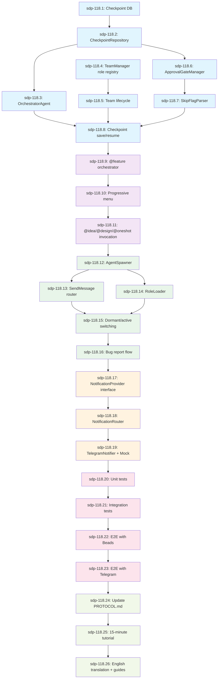

# Workstreams for F024: Unified Workflow - Hybrid SDP Implementation

> **Parent Task:** sdp-118
> **Created:** 2026-01-28
> **Total Workstreams:** 26
> **Estimated Duration:** 8-9 weeks
> **Estimated LOC:** 10,700

---

## Execution Graph



---

## Workstreams by Phase

### Phase 1: Core Infrastructure (Week 1-2)

| # | ID | Title | Est. LOC | Duration | Ready | Dependencies |
|---|-----|-------|----------|----------|-------|--------------|
| 1 | sdp-118.1 | Checkpoint database schema | 200 | 1-2h | ✅ | - |
| 2 | sdp-118.2 | CheckpointRepository implementation | 350 | 2-3h | ⏳ | WS-001 |
| 3 | sdp-118.3 | OrchestratorAgent core logic | 550 | 4-5h | ⏳ | WS-002 |
| 4 | sdp-118.4 | TeamManager role registry | 450 | 3-4h | ✅ | - |
| 5 | sdp-118.5 | Team lifecycle management | 400 | 2-3h | ⏳ | WS-004 |
| 6 | sdp-118.6 | ApprovalGateManager implementation | 350 | 2-3h | ⏳ | WS-002 |
| 7 | sdp-118.7 | SkipFlagParser integration | 150 | 1h | ⏳ | WS-006 |
| 8 | sdp-118.8 | Checkpoint save/resume logic | 500 | 3-4h | ⏳ | WS-003, WS-005, WS-007 |

**Phase 1 Total:** 2,950 LOC, 18-25 hours (2-3 days with testing)

---

### Phase 2: @feature Skill (Week 3)

| # | ID | Title | Est. LOC | Duration | Ready | Dependencies |
|---|-----|-------|----------|----------|-------|--------------|
| 9 | sdp-118.9 | @feature skill orchestrator | 450 | 3-4h | ⏳ | WS-008 |
| 10 | sdp-118.10 | Progressive menu UI | 400 | 2-3h | ⏳ | WS-009 |
| 11 | sdp-118.11 | @idea/@design/@oneshot invocation | 350 | 2-3h | ⏳ | WS-010 |

**Phase 2 Total:** 1,200 LOC, 7-10 hours (1 day with testing)

---

### Phase 3: Agent Runtime (Week 4-5)

| # | ID | Title | Est. LOC | Duration | Ready | Dependencies |
|---|-----|-------|----------|----------|-------|--------------|
| 12 | sdp-118.12 | AgentSpawner via Task tool | 400 | 2-3h | ⏳ | WS-011 |
| 13 | sdp-118.13 | SendMessage router | 450 | 3-4h | ⏳ | WS-012 |
| 14 | sdp-118.14 | RoleLoader and prompt management | 250 | 1-2h | ⏳ | WS-012 |
| 15 | sdp-118.15 | Dormant/active role switching | 500 | 3-4h | ⏳ | WS-013, WS-014 |
| 16 | sdp-118.16 | Bug report flow integration | 400 | 2-3h | ⏳ | WS-015 |

**Phase 3 Total:** 2,000 LOC, 11-16 hours (2 days with testing)

---

### Phase 4: Notification System (Week 6)

| # | ID | Title | Est. LOC | Duration | Ready | Dependencies |
|---|-----|-------|----------|----------|-------|--------------|
| 17 | sdp-118.17 | NotificationProvider interface | 200 | 1-2h | ⏳ | WS-016 |
| 18 | sdp-118.18 | NotificationRouter implementation | 400 | 2-3h | ⏳ | WS-017 |
| 19 | sdp-118.19 | TelegramNotifier + Mock provider | 550 | 3-4h | ⏳ | WS-018 |

**Phase 4 Total:** 1,150 LOC, 6-9 hours (1 day with testing)

---

### Phase 5: Testing Suite (Week 7-8)

| # | ID | Title | Est. LOC | Duration | Ready | Dependencies |
|---|-----|-------|----------|----------|-------|--------------|
| 20 | sdp-118.20 | Unit tests for core components | 600 | 4-5h | ⏳ | WS-019 |
| 21 | sdp-118.21 | Integration tests for agent coordination | 550 | 3-4h | ⏳ | WS-020 |
| 22 | sdp-118.22 | E2E tests with real Beads | 450 | 2-3h | ⏳ | WS-021 |
| 23 | sdp-118.23 | E2E tests with real Telegram | 250 | 1-2h | ⏳ | WS-022 |

**Phase 5 Total:** 1,850 LOC, 10-14 hours (2 days)

---

### Phase 6: Documentation (Week 9)

| # | ID | Title | Est. LOC | Duration | Ready | Dependencies |
|---|-----|-------|----------|----------|-------|--------------|
| 24 | sdp-118.24 | Update PROTOCOL.md with unified workflow | 400 | 2-3h | ⏳ | WS-023 |
| 25 | sdp-118.25 | Create 15-minute tutorial | 350 | 2-3h | ⏳ | WS-024 |
| 26 | sdp-118.26 | English translation + role setup guide | 450 | 3-4h | ⏳ | WS-025 |

**Phase 6 Total:** 1,200 LOC, 7-10 hours (1-2 days)

---

## Execution Strategy

### Parallel Execution Opportunities

**Round 1 (Can start immediately):**
- sdp-118.1: Checkpoint database schema
- sdp-118.4: TeamManager role registry

**Round 2 (After WS-001, WS-004):**
- sdp-118.2: CheckpointRepository (blocked by WS-001)
- sdp-118.5: Team lifecycle (blocked by WS-004)

**Round 3 (After WS-002):**
- sdp-118.3: OrchestratorAgent (blocked by WS-002)
- sdp-118.6: ApprovalGateManager (blocked by WS-002)

### Critical Path

```
WS-001 → WS-002 → WS-003 ┐
                        ├→ WS-008 → WS-009 → ... → WS-026
WS-004 → WS-005 ────────┘
WS-002 → WS-006 → WS-007 ─┘
```

**Longest path:** WS-001 → WS-002 → WS-003 → WS-008 → ... → WS-026 (26 steps)

**Estimated completion:** 8-9 weeks with single developer, 4-5 weeks with 2-3 parallel agents

---

## Ready to Start

```bash
# Check ready tasks
bd ready

# Start first workstream
@build sdp-118.1  # Checkpoint database schema

# Or use autonomous execution
@oneshot sdp-118  # Executes all 26 WS in dependency order
```

---

## Success Metrics

| Metric | Target | Measurement |
|--------|--------|-------------|
| **Features completed** | 26/26 workstreams | `bd show sdp-118` |
| **Test coverage** | ≥ 80% | `pytest --cov` |
| **E2E tests passing** | 100% | Real Beads + Telegram |
| **Documentation complete** | 3/3 docs | PROTOCOL.md + tutorial + guides |
| **Team roles registered** | 100+ | Team config JSON |

---

**Status:** ✅ Decomposition Complete
**Next:** Start with WS-001 (Checkpoint database schema)
