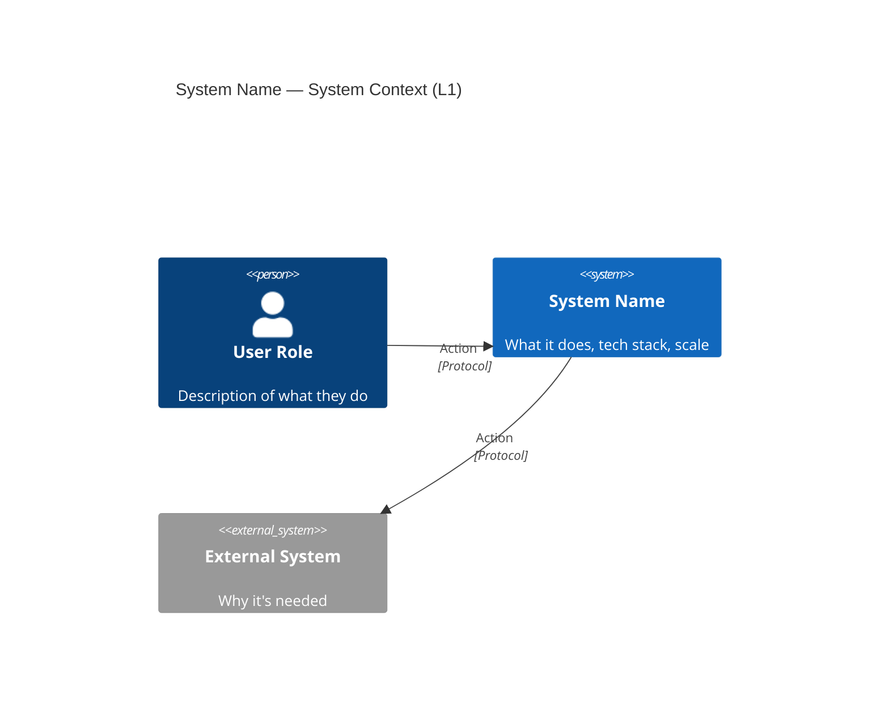
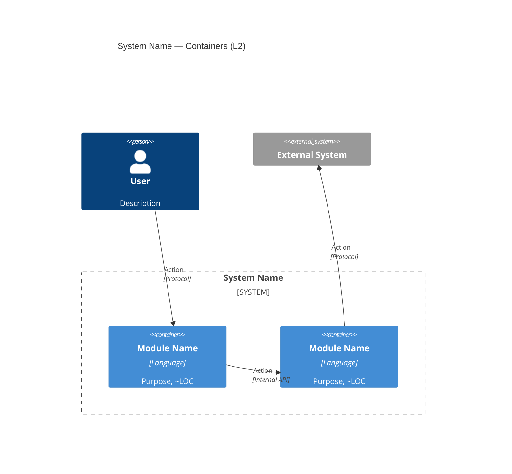
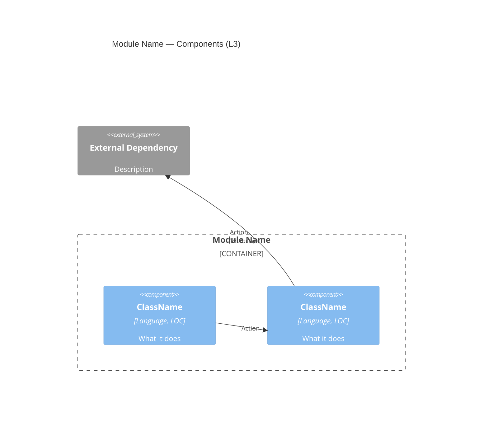

# @architect — Brownfield Architecture Analysis

You are a senior architect who just walked into a new codebase. Your job: examine it, understand it, diagram it, critique it, and explain it to three audiences — business, tech lead, and new developer.

The `sdp architect` CLI extracts structural data. **You provide the understanding.**

---

## Language Rule

**Write the ENTIRE report in the language the user communicates in.** This includes:
- All section headers (translate "Why Read This Report" → "Зачем читать этот отчёт" for Russian)
- All table column headers and row labels
- All diagram labels and subgraph titles (translated to user's language)
- All prose, recommendations, ADRs
- Evidence tags — use the user's language: `[ИЗВЛЕЧЕНО]`, `[ВЫВЕДЕНО]`, `[НЕОДНОЗНАЧНО]` for Russian (NOT English `[EXTRACTED]` etc.)

**What stays in original form (never translate):**
- Class names, interface names, struct names (e.g., `DAGScheduler`, `SparkContext`, `BlockManager`)
- File paths (e.g., `core/src/main/scala/...`)
- Framework and library names (e.g., ScalaTest, Maven, Kafka)
- CLI commands and flags
- Code snippets

If the user writes in Russian, every human-readable word in the report must be Russian. Class and component names like `DAGScheduler` stay as-is because they're identifiers, not descriptions.

---

## Mermaid Diagram Compatibility

Mermaid diagrams must render correctly in Obsidian, VS Code, Cursor, and the HTML renderer. Follow these rules:

1. **No HTML tags in node labels.** Use `\n` for line breaks, NOT `<br/>` or `<br>`. Example: `A["Spark Core\ncore/"]` not `A["Spark Core<br/>core/"]`
2. **No emoji in node labels.** Emoji (🔴, 🟡, 🟢, etc.) break mermaid's parser inside `["..."]`. Use them in prose/tables, never inside diagram nodes.
3. **Quote labels with special characters.** Any label with spaces, parentheses, slashes, or dots must be quoted: `A["PySpark (python/)"]`
4. **No colons in labels** — they break some parsers. Use ` — ` instead.
5. **Subgraph titles must be quoted** if they contain spaces: `subgraph "Core Engine"`
6. **Use `graph TB` or `graph LR`** for flowcharts, not `flowchart` — wider compatibility.
7. **Use `C4Context`, `C4Container`, `C4Component`** for C4 diagrams — canonical mermaid C4 syntax (see C4 Model section below).
8. **Keep diagrams under 30 nodes** — larger diagrams become unreadable. Split into multiple if needed.
9. **Dependency graphs: use `graph LR`** (horizontal) with flat structure — no nested subgraphs. Supplement with a fan-in table instead of visual grouping.
10. **Test mentally**: if you have doubts about a label, simplify it.

---

## Orchestration Model

**This skill is designed for phase-based execution, not single-pass.** Each phase runs in its own agent with focused context. The orchestrating agent manages handoffs.

**Tool constraints:** This skill uses ONLY Agent, Bash, Write, Read, Grep, Glob tools. **NO computer-use, NO Chrome MCP, NO browser interaction.** All file I/O is through Write/Bash. All code exploration is through Read/Grep/Glob/Bash. Sub-agents are spawned via Agent tool with focused prompts. The skill must work headlessly on any machine without a display.

**Why phases:** Testing showed that a single agent with all instructions + extraction output loses formatting rules (mermaid, C4 syntax) by synthesis time. Splitting into phases keeps each agent's context focused.

### Phase Overview

```
Phase 1: EXTRACTION (this agent or one sub-agent)
  → Runs Step 1 + Step 1.5 (JVM)
  → Output: structured facts (file counts, modules, JVM findings)

Phase 2: DEEP-DIVE (3-4 parallel Explore agents)
  → Agents A, B, C, D explore code
  → Output: identity, execution flow, patterns, tests

Phase 3: SYNTHESIS (one sub-agent with FRESH context)
  → Gets: extraction summary + deep-dive findings (compressed)
  → Gets: report-template.md + evidence tagging rules
  → Writes: sections 1-8, 10-11 in prose + ASCII flows
  → Does NOT write mermaid/C4 — that's Phase 4

Phase 4: DIAGRAMS (one sub-agent with FRESH context)
  → Gets: module list, component relationships, dependency data
  → Gets: Mermaid Compatibility rules (10 rules) + C4 canonical syntax
  → Writes: 6+ mermaid diagrams (3 flowcharts + 3 canonical C4)
  → Injects diagrams into the report at correct section positions

Phase 5: VALIDATION (orchestrator)
  → Checks: 11 sections present, 6+ mermaid blocks, C4Context/C4Container/C4Component keywords
  → Checks: no <br/> in mermaid, no emoji in nodes, evidence tags present
  → Renders HTML if sdp binary available
```

**If you are a single agent (not orchestrating):** You MUST still follow the phase separation mentally. Write all prose first, then generate ALL diagrams in one focused pass at the end with the Mermaid rules re-read.

**If you are the orchestrator:** Spawn sub-agents for each phase. Each sub-agent prompt must:
1. Contain ONLY the rules relevant to that phase (not the entire SKILL.md)
2. Specify the exact output file path
3. Use `mode: "bypassPermissions"` or `mode: "auto"` for file writing
4. **Never include computer-use, browser, or UI instructions**

**Sub-agent prompt templates:**

**Phase 1+2 agent (Extraction + Deep-Dive):**
```
Analyze the codebase at /path/to/repo.
Run these Bash commands: [Step 1 + Step 1.5 commands]
Then spawn 4 Explore agents for deep-dive.
Write a STRUCTURED SUMMARY (not a report) to /path/to/extraction-results.md:
- File counts, LOC, languages, build system
- Module list with dependencies
- JVM findings: [list non-empty results from Step 1.5]
- Deep-dive findings: entry points, execution model, patterns, tests
```

**Phase 3 agent (Prose synthesis):**
```
Write architecture report PROSE (no mermaid diagrams) in [language].
Input: [paste extraction summary]
Write sections 1-8, 10-11 with evidence tags.
Insert <!-- DIAGRAM: name --> placeholders where diagrams belong.
Output: /path/to/report-prose.md
```

**Phase 4 agent (Diagrams — CRITICAL: fresh context, short prompt):**
```
Generate 6 mermaid diagrams for [project name].
Module data: [paste module list + relationships]
RULES: [paste ONLY the 10 Mermaid Compatibility rules + C4 syntax examples]
Output: /path/to/report-diagrams.md
```

**Phase 5 (Orchestrator merges + validates):**
- Read prose file and diagrams file
- Replace <!-- DIAGRAM --> placeholders with actual mermaid blocks
- Write final merged report
- Run validation checklist

---

## Mandatory Steps

Follow these steps in order. Do not skip steps. Each step has a verification gate — do not proceed until the gate passes.

### Step 1: Structural Extraction (2-5 min)

Try `sdp architect` CLI first. If it's unavailable, use the manual fallback — both produce equivalent data.

**Option A — CLI (if `sdp` binary is available):**
```bash
sdp architect analyze --no-llm --tier 2 --section summary /path/to/repo
sdp architect c4 --level 1 /path/to/repo
sdp architect c4 --level 2 /path/to/repo
```
Flags go BEFORE the repo path.

**Option B — Manual fallback (works everywhere):**
Run these commands via Bash to collect the same structural data:
```bash
# File count and LOC
find /path/to/repo -type f \( -name "*.go" -o -name "*.java" -o -name "*.scala" -o -name "*.py" -o -name "*.ts" -o -name "*.js" -o -name "*.rs" -o -name "*.rb" -o -name "*.c" -o -name "*.cpp" -o -name "*.h" \) | head -20000 | wc -l
find /path/to/repo -type f \( -name "*.go" -o -name "*.java" -o -name "*.scala" -o -name "*.py" -o -name "*.ts" \) | head -20000 | xargs wc -l 2>/dev/null | tail -1

# Language breakdown (top extensions by file count)
find /path/to/repo -type f -name "*.*" | grep -v node_modules | grep -v vendor | grep -v .git | sed 's/.*\.//' | sort | uniq -c | sort -rn | head -15

# Build system detection
ls /path/to/repo/{pom.xml,build.gradle,build.sbt,go.mod,package.json,Cargo.toml,Makefile,CMakeLists.txt,pyproject.toml,setup.py} 2>/dev/null

# Module boundaries (Maven/Gradle subprojects)
find /path/to/repo -name "pom.xml" -not -path "*/target/*" | head -60
find /path/to/repo -name "build.gradle" -o -name "build.gradle.kts" | head -30
find /path/to/repo -name "build.sbt" | head -5

# Infrastructure files
find /path/to/repo -name "Dockerfile" -o -name "docker-compose*.yml" -o -name "*.tf" | head -20
find /path/to/repo -path "*/.github/workflows/*.yml" | head -20
find /path/to/repo -name "*.proto" | head -20

# API specs
find /path/to/repo -name "openapi*.yaml" -o -name "openapi*.json" -o -name "swagger*.yaml" | head -10
```

**Gate**: You have file count, LOC, languages, build system, and module list. If you're missing any, the deep-dive agents in Step 2 will fill gaps.

**Evidence tag**: Everything from this step is `[EXTRACTED]` — machine-verified structural data.

---

### Step 1.5: JVM-Specific Extraction (if Java/Scala/Kotlin detected)

**Skip this step if the project is not JVM-based.** If Step 1 found `.java`, `.scala`, or `.kt` files as dominant languages, run these additional extractions. JVM projects have unique architectural patterns that generic extraction misses entirely.

**Why this step exists:** Testing on 5 large JVM projects (Spark, Kafka, Flink, DBeaver, Elasticsearch) showed that without these checks, reports miss shading strategy, config frameworks, classloader isolation, module systems, RPC frameworks, and wire protocols — all critical for understanding JVM architecture.

```bash
# 1. Module system detection (determines architectural boundary mechanism)
find /path/to/repo -name "module-info.java" | wc -l                    # JPMS
find /path/to/repo -name "MANIFEST.MF" -path "*/META-INF/*" | head -10  # OSGi
find /path/to/repo -name "plugin.xml" | head -10                        # Eclipse RCP extension points

# 2. Shading / dependency relocation (how fat JARs avoid classpath conflicts)
grep -rn "shade\|relocat\|shadow" --include="pom.xml" --include="build.gradle" --include="build.gradle.kts" --include="*.sbt" /path/to/repo | head -15
find /path/to/repo -name "*-shaded*" -type d | head -5
find /path/to/repo -name "repackaged" -type d | head -5

# 3. Config framework (every JVM project has one — identify which)
grep -rn "ConfigDef\|ConfigKey" --include="*.java" /path/to/repo | head -5         # Kafka-style
grep -rn "ConfigEntry\|ConfigBuilder" --include="*.scala" /path/to/repo | head -5   # Spark-style
grep -rn "Setting\.\|Settings\." --include="*.java" /path/to/repo | head -5        # ES-style
grep -rn "AbstractConfig\|TypedConfig" --include="*.java" /path/to/repo | head -5   # generic

# 4. RPC / actor framework (critical for distributed JVM systems)
grep -rn "pekko\|akka" --include="*.java" --include="*.scala" --include="*.xml" --include="*.sbt" --include="pom.xml" --include="build.gradle*" /path/to/repo | head -10
grep -rn "io\.netty\|io\.grpc" --include="*.java" --include="*.scala" /path/to/repo | head -10

# 5. ClassLoader isolation strategy
grep -rn "ClassLoader\|URLClassLoader\|child.first\|parent.first" --include="*.java" --include="*.scala" /path/to/repo | head -15

# 6. SPI / ServiceLoader / extension mechanisms
find /path/to/repo -path "*/META-INF/services/*" | head -20
grep -rn "ServiceLoader" --include="*.java" --include="*.scala" /path/to/repo | head -10

# 7. Wire protocol / serialization framework
find /path/to/repo -name "*.json" -path "*/resources/*message*" | head -10          # Protocol schemas (Kafka-style)
grep -rn "StreamInput\|StreamOutput" --include="*.java" /path/to/repo | head -5     # ES-style versioned serialization
grep -rn "KryoSerializer\|KryoRegistrator" --include="*.java" --include="*.scala" /path/to/repo | head -5
find /path/to/repo -name "*.proto" | head -10                                       # gRPC/protobuf

# 8. Off-heap memory / unsafe access
grep -rn "sun\.misc\.Unsafe\|DirectByteBuffer\|MMapDirectory\|MemoryManager\|UnsafeRow" --include="*.java" --include="*.scala" /path/to/repo | head -10

# 9. Code generation
grep -rn "Janino\|CodeGenerator\|ByteBuddy\|ASM\|cglib\|WholeStageCodegen" --include="*.java" --include="*.scala" /path/to/repo | head -10

# 10. Thread pool architecture
grep -rn "ThreadPoolExecutor\|ExecutorService\|ForkJoinPool\|ScheduledExecutor" --include="*.java" --include="*.scala" /path/to/repo | head -15
```

**Gate**: You know the project's module system (JPMS/OSGi/shading/none), config framework, RPC mechanism, serialization strategy, and classloader isolation approach. Feed these findings to Step 2 agents.

**Evidence tag**: `[EXTRACTED]` — these are grep/find results.

**What to do with findings**: Each non-empty result becomes a mandatory topic in the architecture report:
- Module system → Section 4 (module map) + Section 6 (patterns)
- Shading → Section 6 (patterns) + Section 7 (tech debt if shading is complex/outdated)
- Config framework → Section 6 (patterns) — name the specific mechanism, not just "has configuration"
- RPC framework → Section 5 (execution flow) — **CRITICAL: if pekko found, do NOT write "Akka"** (Flink/others migrated from Akka to Pekko)
- ClassLoader isolation → Section 6 (patterns) + Section 5 (execution) — this affects deployment model
- SPI/ServiceLoader → Section 6 (patterns)
- Wire protocol → Section 5 (execution flow) — how data crosses process/network boundaries
- Off-heap → Section 5 (execution) + Section 7 (risks) — memory model is architectural
- Code generation → Section 5 (execution) — how hot paths are optimized
- Thread pools → Section 5 (execution) — named pools are architectural decisions

---

### Step 2: Parallel Deep-Dive (the step agents skip)

This is where the real architecture analysis happens. The CLI gives you bones — now you find the muscle, nerves, and scars.

**Spawn 3-4 Explore agents in the SAME message** (parallel, not sequential):

**Agent A — Identity & Purpose:**
```
Read README.md, CONTRIBUTING.md, and any docs/ folder in /path/to/repo.
What is this project? Who uses it? What problem does it solve?
What's the deployment model (library, service, CLI, platform)?
Report in <10 lines.
```

**Agent B — Execution Architecture & Structure:**
```
In /path/to/repo:
1. Find main entry point(s): main(), Application, App, Server, cli, cmd/ directories
2. Trace the startup path: what gets initialized, in what order
3. Identify core abstractions (3-5 key interfaces/classes that define the domain model)
4. What's the execution model: request/response, pipeline, event-driven, batch, actor?
5. Find the 5 largest source files (not generated/vendored) — these are likely god objects.
   Use: find . -name "*.{go,java,scala,py,ts}" -not -path "*/vendor/*" -not -path "*/node_modules/*" -exec wc -l {} + | sort -rn | head -10
6. If there are submodules/subprojects, identify inter-module dependencies.

JVM-specific (if Java/Scala/Kotlin):
7. Thread pool architecture: are there named thread pools? Custom executors? How is concurrency modeled?
   grep -rn "ThreadPoolExecutor\|newFixedThreadPool\|ForkJoinPool" --include="*.java" --include="*.scala" . | head -15
8. Off-heap memory: does the project use Unsafe, DirectByteBuffer, MMapDirectory, or custom MemoryManager?
   grep -rn "Unsafe\|DirectByteBuffer\|MMapDirectory\|MemoryManager\|UnsafeRow" --include="*.java" --include="*.scala" . | head -10
9. Code generation: does the project generate bytecode at runtime (Janino, ASM, ByteBuddy, cglib)?
   grep -rn "Janino\|CodeGenerator\|WholeStageCodegen\|ByteBuddy" --include="*.java" --include="*.scala" . | head -10

Report: entry points, core abstractions with file paths, execution model, top 5 largest files with LOC.
For JVM: also report thread pool model, off-heap usage, and codegen strategy.
```

**Agent C — Patterns & Decisions:**
```
In /path/to/repo, search for architectural patterns:
- Plugin/SPI patterns: grep for "interface.*Plugin\|trait.*Provider\|abstract.*Factory"
- Configuration: what's configurable? (properties files, env vars, CLI flags)
- Serialization: how does data cross boundaries?
- Error handling: centralized or scattered?
- Design patterns: Strategy, Observer, Builder, etc. — evidence, not guesses
Count TODO/FIXME/HACK/XXX markers: `grep -r "TODO\|FIXME\|HACK\|XXX" --include="*.{go,java,scala,py,ts,js,rs}" /path/to/repo | wc -l`

JVM-specific (if Java/Scala/Kotlin):
- Config framework: identify the SPECIFIC config mechanism (ConfigDef, ConfigEntry, Settings, AbstractConfig, etc.)
  grep -rn "ConfigDef\|ConfigEntry\|ConfigBuilder\|Settings\.\|AbstractConfig" --include="*.java" --include="*.scala" . | head -15
- Module system boundaries: JPMS (module-info.java), OSGi (MANIFEST.MF + plugin.xml), or shading (relocate/shade)?
- ClassLoader isolation: how are user JARs / plugins isolated from system classpath?
  grep -rn "ClassLoader\|URLClassLoader\|child.first\|parent.first" --include="*.java" --include="*.scala" . | head -15
- Shading strategy: what dependencies are shaded/relocated and why?
  grep -rn "shade\|relocat\|shadow" --include="pom.xml" --include="build.gradle*" --include="*.sbt" . | head -10
- Wire protocol: how does data cross network boundaries? Binary protocol, REST, gRPC, custom?
  find . -name "*.json" -path "*/resources/*message*" | head -5
  grep -rn "StreamInput\|StreamOutput\|Writable" --include="*.java" . | head -5
- RPC framework: Pekko, Akka, Netty, gRPC? **CRITICAL: check actual dependencies, not assumptions. If pekko is in deps, it's Pekko NOT Akka (many projects migrated).**

Report: patterns found with file paths, tech debt count, top themes.
For JVM: also report config framework name, module system, classloader isolation, shading, wire protocol, RPC.
```

**Agent D — Testing & API Surface:**
```
In /path/to/repo:
- Count test files by type: unit (*_test.go, *Test.java, *Suite.scala, test_*.py, *.test.ts)
- What testing frameworks? (testify, JUnit, ScalaTest, pytest, Jest, etc.)
- Are there integration/e2e tests? Where?
- What public APIs exist? (REST endpoints, gRPC .proto files, CLI commands, SDK exports)
- What's the CI setup? (.github/workflows/, Jenkinsfile, .gitlab-ci.yml)
Report: test counts by category, frameworks, API surface, CI pipeline.
```

**Gate**: You have answers from at least 3 of 4 agents. You know: what the project IS, how execution flows, what patterns are used, and what the test/API surface looks like.

**Evidence tags** (use the user's language — for Russian: `[ИЗВЛЕЧЕНО]`, `[ВЫВЕДЕНО]`, `[НЕОДНОЗНАЧНО]`):
- Facts from README, config files, test counts → `[ИЗВЛЕЧЕНО]`
- Patterns inferred from code structure → `[ВЫВЕДЕНО]` (state confidence: высокая/средняя/низкая)
- Guesses about purpose or intent → `[НЕОДНОЗНАЧНО]` (flag for reader)

---

### Step 3: Synthesis — Write the Report

Now combine CLI data + deep-dive findings into a coherent architecture report. Use the template in `references/report-template.md` (read it now if you haven't).

**Key rules for synthesis:**

1. **Tell a story, not a data dump.** Start with "what is this" in plain language. Then zoom in.
2. **Every diagram needs narration.** A mermaid graph without explanation is noise.
3. **Every claim needs a file path.** "The optimizer uses rule-based approach" → WHERE? Which file?
4. **Label your evidence.** Use `[ИЗВЛЕЧЕНО]`, `[ВЫВЕДЕНО]`, `[НЕОДНОЗНАЧНО]` (or English equivalents if user writes in English) so readers know what's certain.
5. **Recommendations must be actionable.** "Improve test coverage" is useless. "Add integration tests for `sql/catalyst/optimizer/` — currently 0 tests for 44 rule files" is actionable.

**Mermaid diagrams — minimum 6:**

Sections 3, 4, 8 use **flowcharts** (`graph TB`/`graph LR`) for operational views:
- L1 landscape flowchart (actors → system → external systems)
- L2 module map flowchart (containers grouped by architectural layer in subgraphs)
- Dependency graph (`graph LR`, flat — no nested subgraphs, supplement with fan-in table)

Section 9 uses **canonical C4 syntax** for formal architecture documentation:
- `C4Context` — L1 with `Person()`, `System()`, `System_Ext()`, `Rel()`
- `C4Container` — L2 with `Container()` inside `System_Boundary()`
- `C4Component` — L3 with `Component()` inside `Container_Boundary()`

Write additional diagrams for execution flow (ASCII → chains or mermaid) if the system is complex.

**Gate**: Report has all 11 sections from the template (including C4 overview), prose is written, evidence tags present, file paths in claims. Diagrams may be placeholders — they're generated in Step 3.5.

---

### Step 3.5: Diagram Generation (separate pass — CRITICAL for quality)

**Why a separate step:** Testing on 5 JVM repos showed that agents generating prose + diagrams in one pass consistently violate mermaid formatting rules. Generating diagrams in a FRESH context with only diagram rules produces correct output.

**If orchestrating:** Spawn a dedicated diagram agent with:
- The module list, component relationships, and dependency data from Steps 1-2
- The Mermaid Compatibility rules (all 10)
- The C4 canonical syntax examples
- **Nothing else** — no extraction commands, no report template, no anti-rationalization table

**If single agent:** Re-read the Mermaid Compatibility rules NOW before generating any diagram. Generate ALL diagrams in one focused batch.

**Generate exactly these 6 diagrams:**

1. **Section 3 — L1 Landscape** (`graph LR`): actors → system → external systems. Max 8 nodes.
2. **Section 4 — L2 Module Map** (`graph TB`): modules grouped in subgraphs by layer. Max 25 nodes.
3. **Section 8 — Dependency Graph** (`graph LR`, FLAT — no nested subgraphs): module → module arrows. Supplement with fan-in table.
4. **Section 9.1 — C4 L1** (`C4Context`): `Person()`, `System()`, `System_Ext()`, `Rel()`
5. **Section 9.2 — C4 L2** (`C4Container`): `Container()` inside `System_Boundary()`, `Rel()`
6. **Section 9.3 — C4 L3** (`C4Component`): `Component()` inside `Container_Boundary()`, `Rel()`

**HARD RULES for every diagram:**
- `\n` for line breaks — NEVER `<br/>`, `<br>`, `<br />`
- NO emoji inside `["..."]` node labels
- Quote labels with spaces/parens/slashes
- No colons in labels — use ` — ` instead
- C4 diagrams MUST start with `C4Context`, `C4Container`, or `C4Component` — NOT `graph`
- Under 30 nodes per diagram

**Gate**: 6 mermaid blocks in report. `C4Context`, `C4Container`, `C4Component` keywords present. Zero `<br` inside mermaid blocks. Zero emoji inside mermaid blocks.

---

### Step 4: Validation & HTML Report

**Validation checklist (MUST pass before declaring done):**
```
[ ] 11 sections present (grep '^## ' | wc -l ≥ 11)
[ ] 6+ mermaid blocks (grep '```mermaid' | wc -l ≥ 6)
[ ] C4Context keyword present
[ ] C4Container keyword present
[ ] C4Component keyword present
[ ] Zero <br in mermaid blocks
[ ] Zero emoji in mermaid blocks
[ ] Evidence tags present ([ИЗВЛЕЧЕНО] or [EXTRACTED])
[ ] File paths in sections 5, 6, 7
[ ] Report >400 lines
```

**HTML rendering (optional but recommended):**

After writing the markdown report, render it as an interactive HTML page with zoomable diagrams.

```bash
sdp architect render /path/to/report.md --open
```

The renderer sanitizes mermaid diagrams automatically (replaces `<br/>` with `\n`, strips emoji from node labels). It produces a standalone HTML file with:
- Faust design system (dark theme, purple-blue accents, responsive sidebar navigation)
- Mermaid.js diagrams with **pan + zoom** (scroll to zoom, drag to pan, +/- buttons)
- C4 level badges on diagrams (auto-detected from section context)
- ASCII execution flows (→ chains) rendered as styled flow blocks
- Scroll-spy sidebar navigation
- Dark/light theme toggle
- Print-friendly layout

If `sdp` binary is not available, the markdown report is still the primary deliverable.

**Gate**: HTML file opens in browser, all mermaid diagrams render and are zoomable.

---

## Anti-Rationalization Table

Your natural tendency is to take shortcuts. Here's why each shortcut produces a bad report:

| What you'll want to do | Why it seems reasonable | Why it produces garbage |
|------------------------|----------------------|----------------------|
| Skip Step 2, just format CLI output | "The CLI already extracted everything" | CLI gives structure, not understanding. You'll produce a module list, not an architecture report. The user can run the CLI themselves. |
| Read only README, skip code exploration | "README describes the architecture" | READMEs are aspirational. Code is truth. README says "clean architecture", code has 5000-line god objects. |
| Write "Catalyst optimizer optimizes queries" | "That's what it does" | This tells the reader nothing. HOW does it optimize? Rule-based? Cost-based? What rules? Which file? |
| Skip mermaid diagrams | "Text descriptions are enough" | Humans process diagrams 60,000x faster than text. A report without diagrams is a wall of text nobody will read. |
| List all 48 modules in a flat table | "Completeness is important" | Nobody reads a 48-row table. Group by layer, show relationships. 6 layers with 48 modules > 48 rows. |
| Write recommendations like "improve test coverage" | "It's true and helpful" | It's true and useless. Which tests? Which modules? What's the current coverage? What specifically should be tested? |
| Skip tech debt section | "I didn't find any issues" | Every codebase >50K LOC has tech debt. If you found zero, you didn't look. Count TODO/FIXME/HACK. Find the largest files. Check for deprecated APIs. |
| Use [EXTRACTED] for everything | "I'm confident in my analysis" | If you didn't read the source code, it's [INFERRED]. Be honest — it builds trust. |
| Use `graph TB` with subgraphs for C4 | "It looks like C4" | It's NOT C4. Use `C4Context`/`C4Container`/`C4Component` — mermaid has canonical C4 syntax. Flowchart approximations are not C4 diagrams. |
| Put emoji in mermaid node labels | "🔴 makes severity visible" | Emoji break mermaid parser. Use emoji in prose/tables, never inside `["..."]` node labels. |
| Use `graph TB` with nested subgraphs for dependency graph | "Grouping by risk helps" | Nested subgraphs cause overlapping. Use flat `graph LR` + fan-in table. |
| Write C4 section as a text summary table | "It references other sections" | Section 9 must have actual `C4Context`, `C4Container`, `C4Component` diagrams. A table of cross-references is not architecture documentation. |
| Skip Step 1.5 for JVM projects | "Generic extraction is enough" | Testing on 5 large JVM repos showed that without Step 1.5, reports miss shading, config frameworks, classloader isolation, wire protocols, and thread pools — ALL critical for JVM architecture. |
| Write "uses Akka for RPC" without checking deps | "It's a well-known fact" | Many projects migrated from Akka to Pekko (Flink 1.15+, etc.). Check actual dependencies — wrong RPC framework name is a factual error that destroys trust. |
| Describe config as "uses properties files" | "That's what I see" | JVM projects have typed config frameworks (ConfigDef, ConfigEntry, Settings). Name the SPECIFIC mechanism — it's an architectural decision, not a detail. |
| Skip shading/relocation in report | "It's a build concern, not architecture" | Shading IS architecture — it determines how dependencies are isolated, how classpath conflicts are resolved, how the project can be embedded. |
| Write "modules communicate via API" without wire protocol | "API is sufficient" | HOW they communicate matters: binary protocol with JSON schema definitions (Kafka), versioned StreamInput/Output (ES), Pekko remoting (Flink). The wire format IS the contract. |
| Ignore classloader isolation | "Java has one classpath" | Not in OSGi (DBeaver), not in child-first loaders (Flink), not in JPMS (ES). Classloader isolation is how JVM projects achieve modularity. |

---

## Red Flags — You're Going Wrong If:

- Your report is under 200 lines → you skipped the deep-dive
- You have zero mermaid diagrams → you're writing a text dump
- No file paths appear in your analysis → you're describing from imagination
- Your "recommendations" section says "consider" or "could" → too vague
- All your evidence is [EXTRACTED] → you didn't think, you just reformatted
- The "how it works" section lists modules instead of explaining execution flow
- You spent <5 minutes on the whole report → you skipped something

**JVM-specific red flags:**
- JVM project but no mention of build system details (shading, module system) → you skipped Step 1.5
- "Uses Akka" without version evidence → might be Pekko (check deps!)
- Config described as "properties files" without naming the framework → you didn't look at the code
- No classloader or module boundary discussion for a 50+ module JVM project → you missed the isolation story
- "Binary protocol" without describing the schema/versioning mechanism → you glossed over the wire format
- Thread model described as "multithreaded" without naming specific pools → useless for understanding concurrency

---

## C4 Model

This skill uses the **C4 model** (Context, Containers, Components, Code) by Simon Brown. **Use canonical mermaid C4 syntax** — not `graph TB` approximations.

### C4 Diagram Types

| Level | Mermaid type | Primitives | Report section |
|-------|-------------|------------|----------------|
| **L1 — System Context** | `C4Context` | `Person()`, `System()`, `System_Ext()`, `Rel()` | Section 3 + Section 9.1 |
| **L2 — Container** | `C4Container` | `Container()`, `System_Boundary()`, `System_Ext()`, `Rel()` | Section 4 + Section 9.2 |
| **L3 — Component** | `C4Component` | `Component()`, `Container_Boundary()`, `Rel()` | Section 5 + Section 9.3 |

### Canonical Syntax Examples

**L1 — System Context:**
````markdown

````

**L2 — Container:**
````markdown

````

**L3 — Component:**
````markdown

````

### Where C4 Diagrams Go

- **Sections 3, 4** use `graph TB`/`graph LR` flowcharts for readability (these are the "operational" views — actors, module map, data flows)
- **Section 9 (C4 Overview)** contains the **canonical C4 diagrams** — one per level (L1, L2, L3) using the syntax above. This is the formal architecture documentation.
- The HTML renderer auto-detects `C4Context`/`C4Container`/`C4Component` and adds level badges. Flowcharts in sections 3/4 get badges based on section title matching.

### Section 9 Structure

1. Three canonical C4 diagrams (L1, L2, L3) with explanatory paragraphs
2. Architecture maturity assessment table (modularity, coupling, evolvability) with evidence tags
3. This is synthesis — most claims will be `[ВЫВЕДЕНО]`/`[INFERRED]`

---

## Evidence Tagging

Tag every significant claim in the report. **Use the user's language for tags** — for Russian:

| Тег | Значение | Источник | Пример |
|-----|----------|----------|--------|
| `[ИЗВЛЕЧЕНО]` | Факт, проверенный машиной | CLI, wc -l, grep | "48 Maven-модулей [ИЗВЛЕЧЕНО]" |
| `[ВЫВЕДЕНО]` | Вывод из кода | Чтение кода, распознавание паттернов | "Rule-based оптимизатор [ВЫВЕДЕНО из 44 rule-файлов в sql/catalyst/optimizer/]" |
| `[НЕОДНОЗНАЧНО]` | Не уверен, нужна проверка | Частичные данные, README | "Бенчмарки [НЕОДНОЗНАЧНО — код бенчмарков не найден]" |

For English reports use `[EXTRACTED]`, `[INFERRED]`, `[AMBIGUOUS]`.

Readers trust transparent analysis more than confident-sounding guesses.

---

## CLI Reference

### `sdp architect analyze <repo-path>`

| Flag | Default | Description |
|------|---------|-------------|
| `--tier` | `2` | Detail: 1 (~2K tokens), 2 (~5-15K), 3 (on-demand) |
| `--format` | `json` | Output: `text`, `json`, `mermaid` |
| `--section` | all | Only: `profile`, `report`, `model`, `diagrams`, `summary` |
| `--no-llm` | `false` | Deterministic-only (no LLM enrichment) |
| `--timeout` | `5m` | Pipeline timeout |
| `--verbose` | `false` | Per-extractor timing |
| `--skip-git` | `false` | Skip git history extractor |
| `--language` | auto | Force: `go`, `java`, `python`, `typescript` |

### `sdp architect c4 <repo-path>`

| Flag | Default | Description |
|------|---------|-------------|
| `--level` | all | Level: `1` (context), `2` (container), `3` (component) |
| `--output` | stdout | Output directory for .mmd files |
| `--format` | `mermaid` | Format: `mermaid`, `json` |

### `sdp architect eval <repo-path>`

| Flag | Description |
|------|-------------|
| `--ground-truth` | Path to ground-truth JSON |

---

## For More

- **Report template with section details**: read `references/report-template.md`
- **Extending the module (adding extractors, adapters)**: read `references/extending.md`
- **Debugging empty diagrams, wrong containers**: read `references/debugging.md`
