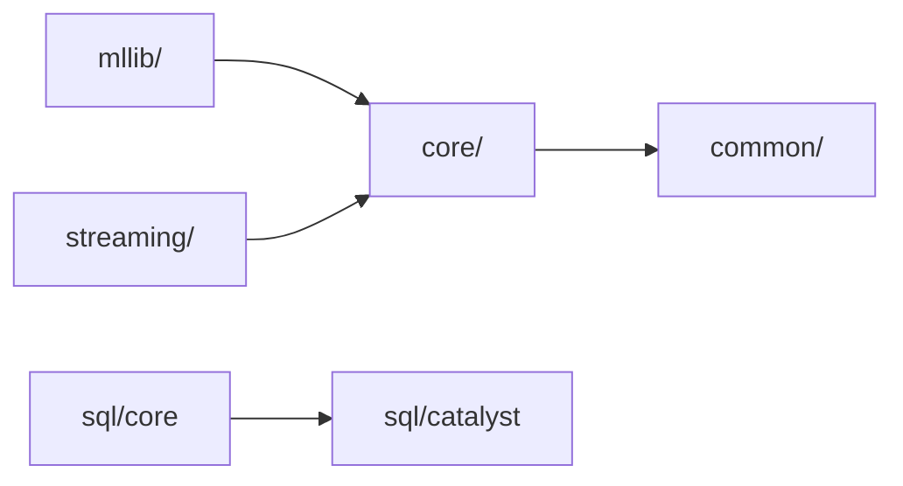
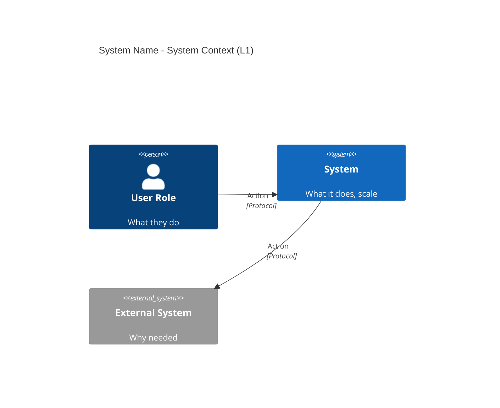
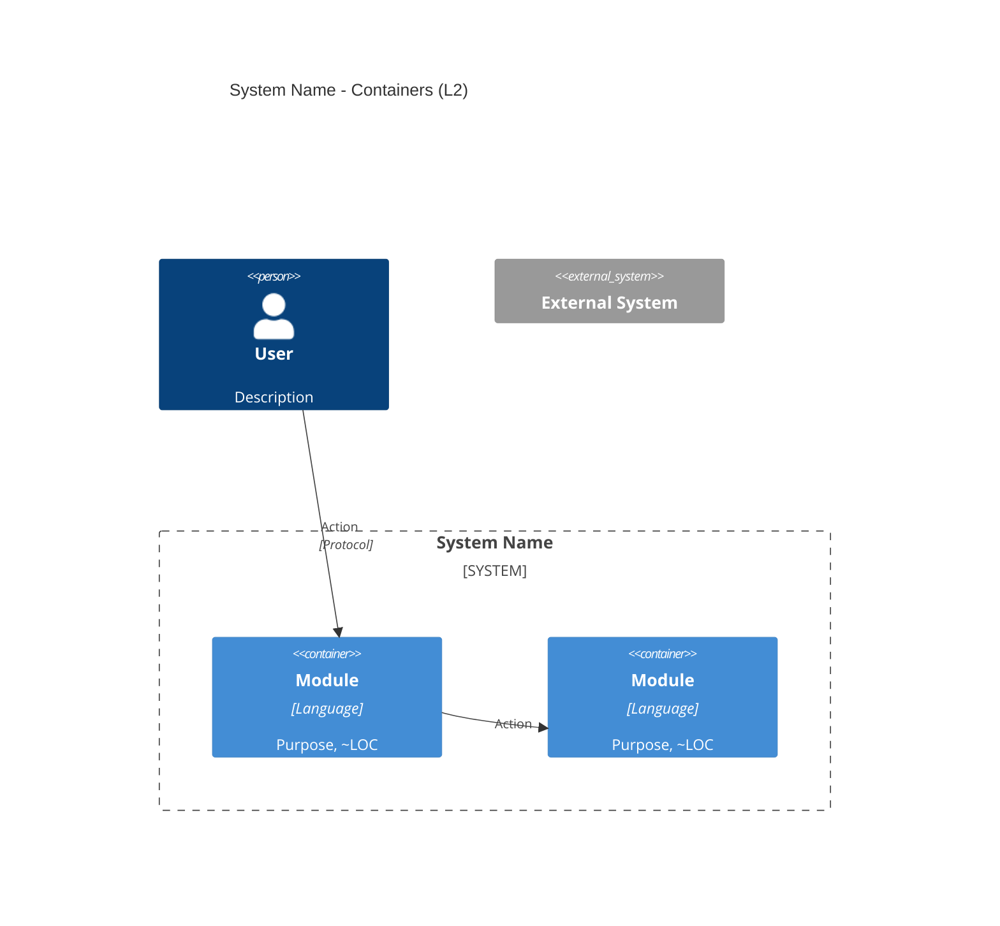
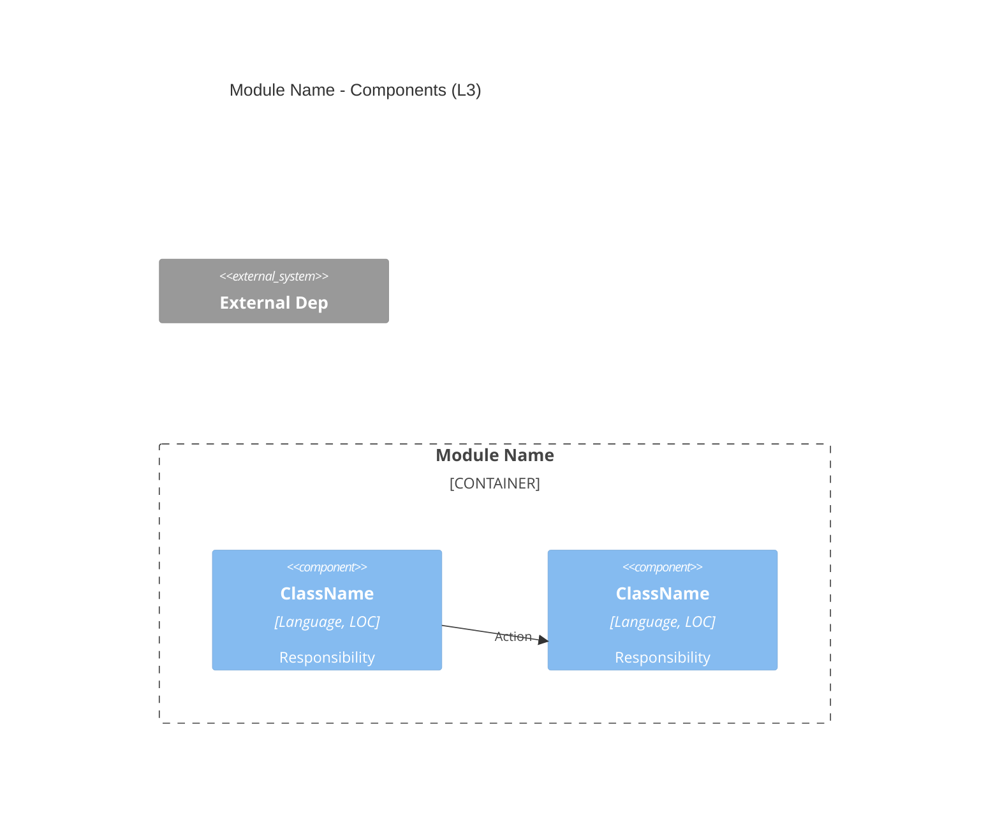

# Architecture Report Template

Use this template for every architecture report. All 11 sections are mandatory.

**CRITICAL: Write EVERYTHING in the user's language.** Section headers, table headers, diagram labels, subgraph titles — all must be translated. Only keep: file paths, class names, framework names, evidence tags (`[EXTRACTED]`, `[INFERRED]`, `[AMBIGUOUS]`).

For Russian users, here are the mandatory section headers:
1. Зачем читать этот отчёт
2. Что это такое
3. Ландшафт — Кто с кем общается (C4 L1)
4. Карта модулей — Что внутри (C4 L2)
5. Как это работает — Архитектура выполнения
6. Архитектурные паттерны
7. Где болит — Техдолг и риски
8. Граф зависимостей
9. C4 — Обзор архитектурных уровней
10. Тестирование и API
11. Рекомендации

---

## Section Guide

### Header Block

```markdown
# {Project Name} — Архитектурный отчёт

> **Дата**: YYYY-MM-DD | **Версия**: X.Y | **Инструмент**: sdp architect
> **Аудитория**: техлид, архитектор, новый разработчик
```

### Section 1: Зачем читать этот отчёт

2-3 sentences: what repo, how big, what you'll learn. Not a summary — a pitch.

**GOOD**: "You inherited 2.9M lines of distributed compute engine with 15 years of history and 48 modules. This report maps the terrain so you don't spend 3 weeks figuring out what I figured out in 30 minutes."

**BAD**: "This report contains the results of an architecture analysis performed by the sdp architect tool."

### Section 2: What Is This — One Paragraph

Plain language explanation for a smart person who's never seen this codebase. What it does, who uses it, how it's deployed.

**GOOD**: "Spark is a distributed data processing engine. It takes data from any source (HDFS, S3, Kafka), processes it across a cluster of machines, and returns results. It's a framework, not a service — you embed it in your application or submit jobs to a cluster."

**BAD**: "Apache Spark is a multi-module Maven project written primarily in Scala with Java and Python components."

### Section 3: Landscape — Who Talks to Whom (L1)

Mermaid **flowchart** (`graph LR` or `graph TB`) showing: users → the system → external systems. Include data flow labels on arrows. This is the "operational" view for quick understanding.

After the diagram: 2-3 sentences explaining the actors and external systems. Not just "uses Kafka" but WHY — "Kafka provides streaming data ingestion for real-time analytics pipelines."

The **canonical C4Context** diagram for this level goes in Section 9.1.

### Section 4: Module Map — What's Inside (L2)

Mermaid **flowchart** (`graph TB`) grouping modules by architectural layer in subgraphs. This is the "operational" view — quick visual reference.

Table: layer → modules → approximate LOC → purpose. Group by FUNCTION, not by directory.

**GOOD**: 6 rows (Core Engine, SQL Engine, ML, Streaming, Connectors, Infra) each containing multiple modules.

**BAD**: 48 rows, one per Maven module, alphabetically sorted.

The **canonical C4Container** diagram for this level goes in Section 9.2.

### Section 5: How It Works — Execution Architecture

**This is the most important section.** It's what separates a real architect's report from a CLI dump.

Show the main execution path as an ASCII or mermaid flow:
- Input → processing stages → output
- Name the key classes/files at each stage
- Explain the execution model (pipeline? event loop? scheduler? actor model?)

Then cover 2-4 key subsystems in depth:
- Not "Optimizer optimizes" but HOW it optimizes: what algorithm, what tradeoffs, what files
- Include file paths so the reader can go look

If there's a new/strategic component (e.g. a new API, a rewrite), give it its own subsection.

**JVM-specific subsections (mandatory if JVM project):**
- **Thread pool architecture**: named pools, sizing strategy, how concurrency is modeled (ES: search/write/management pools; Kafka: request handler pool)
- **Memory model**: heap vs off-heap, GC-sensitive paths, memory managers (Spark: Tungsten/UnsafeRow; ES: MMapDirectory; Flink: MemoryManager)
- **Wire protocol / serialization**: how data crosses network boundaries — name the specific mechanism (Kafka: binary protocol with JSON schema definitions; ES: StreamInput/StreamOutput with version gates; Flink: Pekko remoting)
- **Code generation** (if present): runtime bytecode generation for hot paths (Spark: WholeStageCodegen via Janino; Flink: code-generated operators)

### Section 6: Architectural Patterns

Table: pattern → where used → why it's good/interesting.

Then 3-5 inferred ADRs (Architecture Decision Records):
- What decision was made
- Why (or your best guess)
- What it costs (tradeoffs)

**GOOD**: "Decision: Lazy evaluation for RDD. Why: enables whole-graph optimization before execution. Cost: debugging is harder because nothing happens until an action is called."

**BAD**: "Uses lazy evaluation pattern."

**JVM-specific patterns to look for (mandatory if JVM project):**
- **Config framework**: Name the specific mechanism — ConfigDef (Kafka), ConfigEntry/ConfigBuilder (Spark), Settings (ES). Don't just say "uses properties files."
- **Module system**: JPMS (module-info.java), OSGi (MANIFEST.MF + plugin.xml), or shading (maven-shade-plugin). How are module boundaries defined?
- **ClassLoader isolation**: Child-first (Flink), OSGi bundle isolation (DBeaver), JPMS (ES). How are user JARs / plugins isolated?
- **Shading strategy**: What dependencies are relocated and why? This IS architecture — it determines embedding and deployment model.
- **SPI / extension points**: ServiceLoader (standard Java), OSGi extension points (Eclipse RCP), custom registries. How is the system extended?
- **RPC framework**: **CRITICAL — verify from actual deps, not assumptions.** Pekko ≠ Akka (Flink migrated in 1.15+). Netty (Spark). gRPC (some ES plugins).

### Section 7: Where It Hurts — Tech Debt & Risks

Three subsections:

**Critical risks** — table with severity, location (file path!), impact. These are things that could cause outages or make changes dangerous.

**Architectural debt** — structural problems: god objects (name them, give LOC), deprecated-but-not-removed code, duplicated abstractions, missing boundaries.

**Tech debt metrics** — TODO/FIXME/HACK counts (actual numbers from grep), biggest files, recurring themes.

**GOOD**: "DAGScheduler.scala — 3700 LOC, manages stage lifecycle, shuffle tracking, retry, speculative execution. Any change is high-risk. [EXTRACTED: wc -l]"

**BAD**: "There is some technical debt in the codebase."

### Section 8: Dependency Graph

Mermaid `graph LR` (horizontal) with **flat structure** — no nested subgraphs. Nodes are module names, arrows show "depends on".

**CRITICAL layout rules:**
- Use `graph LR` (horizontal) — reads left to right, fewer crossing arrows
- **No nested subgraphs** — they cause overlapping in mermaid. Use flat nodes.
- **No emoji in node labels** — they break mermaid parser
- Supplement with a **fan-in table**: module → fan-in count → risk level → dependents

**GOOD:**
```markdown


| Module | Fan-in | Risk | Dependents |
|--------|--------|------|------------|
| core/ | 12+ | Critical | mllib, streaming, graphx, ... |
```

**BAD:** `graph TB` with 4 nested subgraphs grouping by risk level — causes overlapping.

### Section 9: C4 — Architecture Levels Overview

**This is where the canonical C4 diagrams live.** Sections 3/4 use flowcharts for quick operational views; Section 9 uses proper C4 mermaid syntax for formal documentation.

**Structure — three subsections, each with a canonical C4 diagram:**

#### 9.1 L1 — System Context (`C4Context`)

```markdown


Follow with 1 paragraph: key insight at this zoom level.
```

#### 9.2 L2 — Containers (`C4Container`)

```markdown


Follow with 1 paragraph: which container dominates, what's the center of gravity.
```

#### 9.3 L3 — Components (`C4Component`)

Pick the **most critical module** (usually the one with highest fan-in or god objects) and diagram its internals.

```markdown


Follow with 1 paragraph: god objects, single points of failure, key classes.
```

#### Architecture Maturity Table

Rate based on evidence from all three levels:

| Criterion | Rating | Evidence |
|-----------|--------|----------|
| Modularity | ... | [INFERRED] |
| Coupling | ... | [EXTRACTED/INFERRED] |
| Evolvability | ... | [INFERRED] |

**BAD Section 9**: A text summary table with no diagrams. That's an outline, not architecture documentation.

**GOOD Section 9**: Three canonical C4 diagrams with explanatory paragraphs and a maturity assessment grounded in evidence.

### Section 10: Testing & API Surface

Table: test category → count → framework → what it covers.

Call out: what's well-tested, what's NOT tested, what the testing strategy is (unit-heavy? integration-heavy? golden tests?).

API surface: what public interfaces exist (REST, gRPC, SDK, CLI). What's stable, what's evolving.

### Section 11: Recommendations

Three subsections for three audiences:

**For tech lead**: table with priority (red/yellow/green), recommendation, reasoning. Be specific: file paths, module names, concrete actions.

**For new developer**: ordered reading list with file paths. "Read X first, then Y, then Z." Not modules — specific files.

**For business**: 3-4 bullets on maturity, risks, strategic direction, alternatives.

---

## Few-Shot Examples

### GOOD Execution Flow (Section 5):

```markdown
### How a SQL query becomes results

SQL string → Parser (ANTLR) → Unresolved Logical Plan
→ Analyzer (115 files, resolves names/types) → Resolved Plan
→ Catalyst Optimizer (44 rule files, batch iteration to fixpoint)
→ Physical Planner (chooses join strategy: BroadcastHash vs SortMerge)
→ DAGScheduler (splits at shuffle boundaries into Stages)
→ TaskScheduler (distributes Tasks to Executors)
→ Executors (TaskRunner + BlockManager, 3-tier storage)
→ Results back to Driver

Key files:
- Parser: sql/catalyst/.../parser/SqlBaseParser.g4
- Optimizer: sql/catalyst/.../optimizer/Optimizer.scala (2947 LOC)
- DAGScheduler: core/.../scheduler/DAGScheduler.scala (3700 LOC)
```

### BAD Execution Flow:

```markdown
### Architecture

Spark has a SQL engine that processes queries. It uses the Catalyst optimizer
and DAG scheduler. Results are computed on executors.
```

(No flow, no file paths, no details — reader learns nothing they couldn't get from Wikipedia.)

### GOOD Tech Debt (Section 7):

```markdown
| # | Problem | Severity | Location | Impact |
|---|---------|----------|----------|--------|
| 1 | God Object: DAGScheduler | 🔴 | core/.../DAGScheduler.scala (3700 LOC) | Stage lifecycle, shuffle tracking, retry, speculative execution all in one file. Any change risks regression |
| 2 | Deprecated DStreams not removed | 🟡 | streaming/ (~150K LOC) | Dead weight — Structured Streaming replaced it in 2016, but backward compat keeps it alive |

Tech debt markers: 142 files with TODO/FIXME/HACK [EXTRACTED: grep -r count]
Top themes: serialization compat (25%), memory management (20%), thread safety (15%)
```

### BAD Tech Debt:

```markdown
The codebase has some technical debt that should be addressed.
Consider improving code quality and test coverage.
```

(No specifics, no numbers, no file paths — completely useless.)
